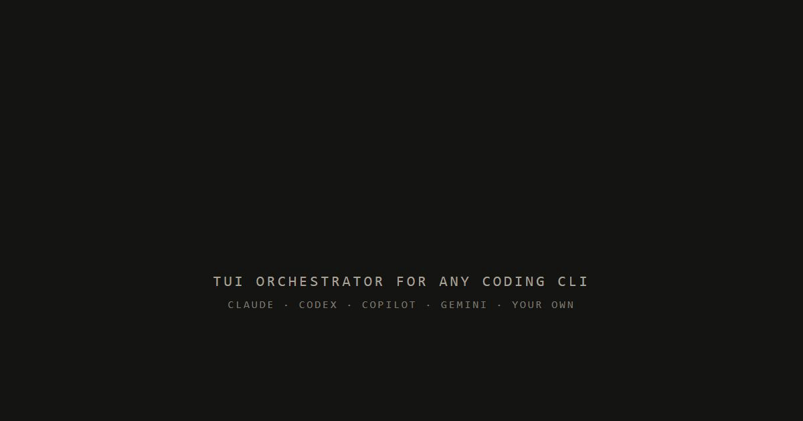

# kobe

<p align="center">
  
</p>

<p align="center">
  <strong>One terminal. Many agents. Every attempt on its own branch.</strong><br />
  kobe runs parallel <a href="https://claude.com/claude-code">Claude Code</a>, <a href="https://github.com/openai/codex">Codex</a>, and <a href="https://github.com/github/copilot-cli">Copilot</a> sessions,<br />
  each in an isolated git worktree — and they keep working after you disconnect.
</p>

<p align="center">
  <a href="https://www.npmjs.com/package/@sma1lboy/kobe"></a>
  <a href="https://github.com/Sma1lboy/kobe/actions/workflows/ci.yml"></a>
  <a href="./LICENSE"></a>
</p>

<p align="center">
  
</p>

AI agents are useful one at a time. kobe is for when you want five attempts running at once: create a task, send it to an engine, compare the worktrees, merge the branch that wins, archive the rest. It runs where your code already lives — laptop, devbox, VPS, anything you can SSH into.

## Highlights

- **Safe parallelism** — agents never trample each other or your checkout; each task gets a private worktree and branch.
- **Sessions survive you** — quit the TUI, drop SSH, restart the daemon; reattach and the screen comes back.
- **Real engines, real environment** — kobe embeds the actual interactive CLIs next to your dependencies, services, and credentials. No API wrappers, no re-rendered streams.
- **Any engine** — `claude`, `codex`, `copilot`, or any command you add via `kobe config`, picked per task.
- **Terminal first** — no browser or desktop app required. Notifications and clipboard ride SSH to your local terminal.
- **Scriptable** — `kobe api` lets a shell script, or another agent, fan out and collect tasks headlessly.

https://github.com/user-attachments/assets/17947cf2-bd90-41d8-9e56-2b30050f6d08

## Install

Requires [Bun](https://bun.sh) ≥ 1.3.11, git, and at least one engine CLI on `PATH`.

```bash
bun install -g @sma1lboy/kobe

# or try it without installing
bunx @sma1lboy/kobe
```

## First run

```bash
ssh devbox        # optional
cd your-repo
kobe
```

Press `n`, pick a repo, base branch, and engine, and prompt the embedded session. The worktree lands in `~/.kobe/worktrees/<repo-key>/<task-slug>/`. Press `F1` anytime for the live keybinding reference; `ctrl+q` focuses the sidebar, and from there quits — sessions keep running in the background.

## How it works

```text
Task = git worktree + hosted engine session + branch
```

1. **The daemon** owns tasks, worktrees, and state — the TUI, the web dashboard, and `kobe api` are all clients of the same one.
2. **The PTY host** is a separate long-lived process that owns the engine sessions, tmux-server style. It outlives the TUI *and* the daemon, which is why disconnects and restarts never kill your work.
3. **The TUI** just attaches: sidebar for tasks, workspace tabs for engines and shells (with splits and quick-fork), a files pane for diffs and PR actions.

## Beyond the TUI

The same tasks from a browser — `kobe web` serves a local dashboard on the daemon the TUI uses, so both surfaces stay in sync:

```bash
kobe web            # http://localhost:5174
```

And headless, for scripts or other agents:

```bash
kobe api fan-out \
  --repo "$PWD" \
  --agents claude:2,codex:1 \
  --prompt "Try three approaches to simplify the auth flow."
```

Install the companion skill so Claude Code knows how to drive `kobe api` itself:

```bash
kobe skill install
```

## If it gets stuck

```bash
kobe doctor            # read-only diagnosis: daemon, PTY host, engines, git
kobe doctor --report   # write a bundle you can attach to a bug report
kobe reset             # stop the runtimes; never touches your worktrees
kobe config            # open kobe's config file in your editor
```

More in [`docs/TROUBLESHOOTING.md`](./docs/TROUBLESHOOTING.md).

## Develop

```bash
bun install
bun run dev:sandbox    # run against a throwaway home, not your real ~/.kobe
bun run test
```

Start with [`CONTRIBUTING.md`](./CONTRIBUTING.md) and [`docs/ARCHITECTURE.md`](./docs/ARCHITECTURE.md); shipped behavior lives in the [changelog](./packages/kobe/CHANGELOG.md).

## License

[MIT](./LICENSE) © Jackson Chen
