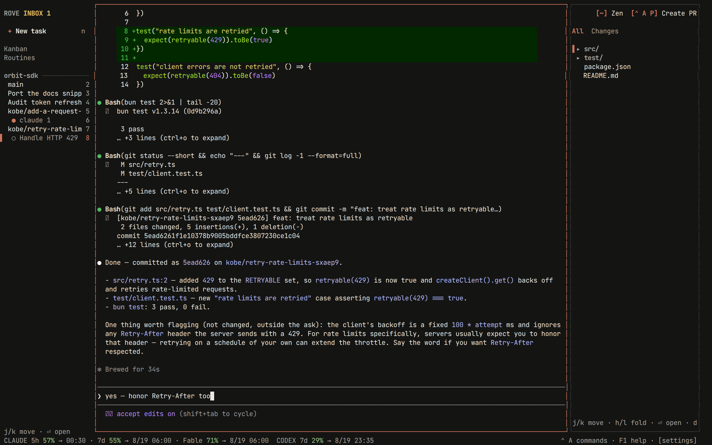

# kobe — the agent multiplexer in your shell

<p align="center">
  
</p>

<p align="center">
  <strong>Multiplex your agents like you multiplex your terminals.</strong><br />
  kobe is an open-source agent multiplexer: it runs <a href="https://claude.com/claude-code">Claude Code</a>, <a href="https://github.com/openai/codex">Codex</a>, and <a href="https://github.com/github/copilot-cli">Copilot</a> in parallel,<br />
  each session on its own git worktree and branch — attach, detach, reattach; they keep working after you disconnect.
</p>

<p align="center">
  <a href="https://www.npmjs.com/package/@sma1lboy/kobe"></a>
  <a href="https://github.com/Sma1lboy/kobe/actions/workflows/ci.yml"></a>
  <a href="./LICENSE"></a>
</p>

<p align="center">
  <a href="https://docs.kobe.sma1lboy.me"><strong>Documentation</strong></a> ·
  <a href="https://docs.kobe.sma1lboy.me/docs/quick-start">Quick start</a> ·
  <a href="https://docs.kobe.sma1lboy.me/docs/concepts">Concepts</a> ·
  <a href="https://docs.kobe.sma1lboy.me/docs/cli">CLI</a> ·
  <a href="https://docs.kobe.sma1lboy.me/docs/api">Agent API</a> ·
  <a href="https://kobe.sma1lboy.me">Website</a>
</p>

<p align="center">
  
</p>

Terminal multiplexers let one terminal hold many shells that survive you. kobe does the same for AI coding agents: one TUI holds many engine sessions, each isolated on its own git worktree and branch, all alive after you close the laptop lid on your SSH connection. Fan a prompt across five attempts, walk away, come back, merge the winner, archive the rest. It runs where your code already lives — laptop, devbox, VPS — with no desktop app and no browser required.

## Why kobe

- **Safe parallelism** — every task is `git worktree + engine session + branch`. Agents never trample each other or your checkout.
- **Sessions survive you** — quit the TUI, drop SSH, restart the daemon; reattach and the screen comes back. A separate PTY host owns the sessions, so nothing you close kills them.
- **Real engines, real environment** — kobe embeds the actual interactive CLIs next to your dependencies, services, and credentials. No API wrappers, no re-rendered streams.
- **Any engine** — `claude`, `codex`, `copilot`, or any command you add via `kobe config`, picked per task.
- **Terminal first** — notifications and clipboard ride SSH back to your local terminal.
- **Agents orchestrating agents** — `kobe api` lets a script, or another AI agent, fan out tasks, supervise them, and collect the results headlessly.

<p align="center">
  <br />
  <a href="docs/assets/demo.mp4">▶ watch the full-quality mp4</a>
</p>

## Install

Requires [Bun](https://bun.sh) ≥ 1.3.11, git, and at least one engine CLI on `PATH`.

```bash
bun install -g @sma1lboy/kobe

# or try it without installing
bunx @sma1lboy/kobe
```

## First run

```bash
ssh devbox        # optional
cd your-repo
kobe
```

Press `n`, pick a repo, base branch, and engine, and prompt the embedded session. The worktree lands in `~/.kobe/worktrees/<repo-key>/<task-slug>/`. Press `F1` anytime for the live keybinding reference; `ctrl+q` focuses the sidebar, and from there quits — sessions keep running in the background.

Full documentation: **[docs.kobe.sma1lboy.me](https://docs.kobe.sma1lboy.me)** — quick start, concepts, CLI, agent API, configuration, keybindings, themes, engines, plugins, troubleshooting.

> **If kobe saves you an afternoon, [star the repo](https://github.com/Sma1lboy/kobe/stargazers)** — it is the single strongest signal that tells other developers this is worth their time.

## Graph engineering: fan out, complete, observe, fan in

Running many agents well is not prompt engineering — it's [graph engineering](https://kobe.sma1lboy.me). Nodes are isolated attempts, edges are dependencies, and the gates are your judgment. kobe gives you a primitive for each step:

**Fan out** — one prompt, N isolated attempts, one command:

```bash
kobe api fan-out --repo "$PWD" \
  --agents claude:2,codex:2,copilot:1 \
  --prompt "Try independent approaches to simplify the auth flow."
```

**Completion** — a worker messages its explicit outcome back to the spawning agent's chat tab (the exact command is baked into its first prompt). Silence is a checkpoint, never a verdict:

```bash
kobe api send --task-id <spawner> --prompt "succeeded: auth flow simplified (branch kobe/auth-flow)"
```

**Observe** — read the engine's own structured session, never scrape a TUI screen:

```bash
kobe api read-output --task-id <id>    # paged history, honest terminal fallback
```

**Fan in** — compare attempts, annotate diffs line-by-line and send the notes back to the agent as a prompt, then land the winner:

```bash
kobe api collect --task-ids a,b,c      # read-only comparison snapshot
kobe api land --task-id a              # merge the winning branch
```

Install the companion skill so Claude Code can drive this loop itself — an agent orchestrating agents while you keep the gates:

```bash
kobe skill install
```

Every verb, flag, and exit code: [Agent API reference](https://docs.kobe.sma1lboy.me/docs/api).

## How it works

```text
Task = git worktree + hosted engine session + branch
```

1. **The daemon** owns tasks, worktrees, and state — the TUI, the web dashboard, and `kobe api` are all clients of the same one.
2. **The PTY host** is a separate long-lived process that owns the engine sessions. It outlives the TUI *and* the daemon, which is why disconnects and restarts never kill your work.
3. **The TUI** just attaches: sidebar for tasks, workspace tabs for engines and shells (with splits and quick-fork), a files pane for diffs, review notes, and PR actions.

The same tasks are available from a browser — `kobe web` serves a local dashboard on the daemon the TUI uses, so both surfaces stay in sync:

```bash
kobe web            # http://localhost:5174
```

## kobe vs desktop agent IDEs

Tools like Conductor and orca wrap parallel agents in an Electron desktop app. kobe makes the opposite bet: **the terminal is the product.**

| | kobe | desktop agent IDEs |
|---|---|---|
| Runs where your code lives | ✅ any box you can SSH into | local app reaching out remotely |
| Survives disconnect | ✅ daemon + PTY host on the host machine | depends on the app staying open |
| Install | `bunx @sma1lboy/kobe` — zero-install trial | download a desktop app |
| Agent-to-agent orchestration | ✅ `kobe api` + companion skill | varies |
| UI | terminal (TUI) + optional local web dashboard | Electron |

If your workflow is already SSH + terminal, kobe fits it instead of replacing it. If you want a desktop app, those tools are good — different bet.

## Use cases worth stealing

- **Competing implementations**: fan the same refactor to Claude and Codex, keep whichever diff reads better.
- **Long-running work from a laptop**: kick off tasks on a devbox over SSH, close everything, reattach after dinner.
- **Agent-driven delivery**: your local Claude Code session uses `kobe api` to spawn, supervise, and merge remote attempts — you only review the final diff.
- **Review with leverage**: annotate an attempt's diff line-by-line in the TUI, send all notes back as one prompt, get a corrected attempt.

If you write about developer tools, this README plus the [landing page](https://kobe.sma1lboy.me) (which links right back here) should give you everything you need — the full manual is at [docs.kobe.sma1lboy.me](https://docs.kobe.sma1lboy.me), and architecture details live in [`docs/ARCHITECTURE.md`](./docs/ARCHITECTURE.md).

## If it gets stuck

```bash
kobe doctor            # read-only diagnosis: daemon, PTY host, engines, git
kobe doctor --report   # write a bundle you can attach to a bug report
kobe reset             # stop the runtimes; never touches your worktrees
kobe config            # open kobe's config file in your editor
```

More in [`docs/TROUBLESHOOTING.md`](./docs/TROUBLESHOOTING.md).

## Develop

```bash
bun install
bun run dev:sandbox    # run against a throwaway home, not your real ~/.kobe
bun run test
```

Start with [`CONTRIBUTING.md`](./CONTRIBUTING.md) and [`docs/ARCHITECTURE.md`](./docs/ARCHITECTURE.md); shipped behavior lives in the [changelog](./packages/kobe/CHANGELOG.md).

## License

[MIT](./LICENSE) © Jackson Chen
