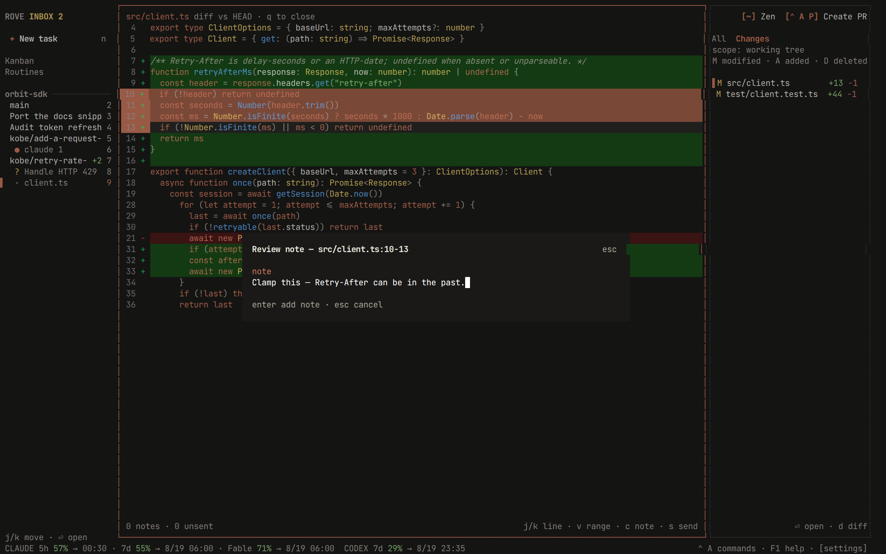
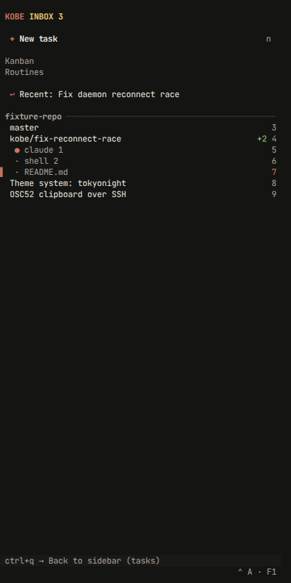
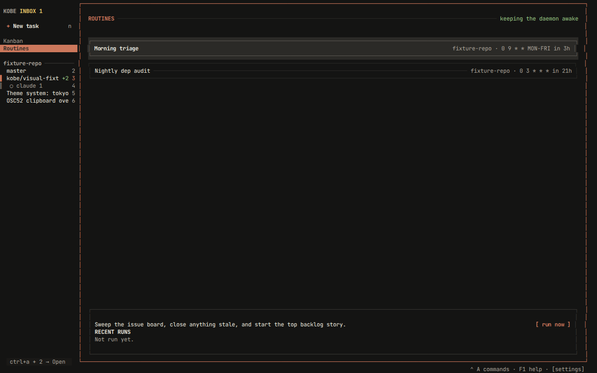

# kobe — the agent multiplexer in your shell

<p align="center">
  
</p>

<p align="center">
  <strong>Multiplex your agents like you multiplex your terminals.</strong><br />
  kobe is an open-source agent multiplexer: it runs <a href="https://claude.com/claude-code">Claude Code</a>, <a href="https://github.com/openai/codex">Codex</a>, <a href="https://github.com/github/copilot-cli">Copilot</a>, Kimi — or any CLI you register — in parallel,<br />
  each session on its own git worktree and branch — attach, detach, reattach; they keep working after you disconnect.
</p>

<p align="center">
  <a href="https://www.npmjs.com/package/@sma1lboy/kobe"></a>
  <a href="https://github.com/Sma1lboy/kobe/actions/workflows/ci.yml"></a>
  <a href="./LICENSE"></a>
</p>

<p align="center">
  <a href="https://docs.kobe.sma1lboy.me"><strong>Documentation</strong></a> ·
  <a href="https://docs.kobe.sma1lboy.me/docs/quick-start">Quick start</a> ·
  <a href="https://docs.kobe.sma1lboy.me/docs/concepts">Concepts</a> ·
  <a href="https://docs.kobe.sma1lboy.me/docs/cli">CLI</a> ·
  <a href="https://docs.kobe.sma1lboy.me/docs/api">Agent API</a> ·
  <a href="https://kobe.sma1lboy.me">Website</a>
</p>

<p align="center">
  
</p>

Terminal multiplexers let one terminal hold many shells that survive you. kobe does the same for AI coding agents: one TUI holds many engine sessions, each isolated on its own git worktree and branch, all alive after you close the laptop lid on your SSH connection. Start the auth refactor, start the flaky-test hunt beside it, walk away, come back to two finished branches. It runs where your code already lives — laptop, devbox, VPS — with no desktop app and no browser required.

## Why kobe

- **Safe parallelism** — every task is `git worktree + engine session + branch`. Agents never trample each other or your checkout.
- **Sessions survive you** — quit the TUI, drop SSH, restart the daemon; reattach and the screen comes back. A separate PTY host owns the sessions, so nothing you close kills them.
- **Real engines, real environment** — kobe embeds the actual interactive CLIs next to your dependencies, services, and credentials. No API wrappers, no re-rendered streams.
- **Any engine, mid-task** — `claude`, `codex`, `copilot`, `kimi`, or your own command. Hand a stuck conversation to another vendor without losing its context.
- **Terminal first** — notifications and clipboard ride SSH back to your local terminal, and the whole UI folds down to a phone-width session.
- **Agents orchestrating agents** — `kobe api` lets a script, or another AI agent, spawn tasks, supervise them, and land the results headlessly.

<p align="center">
  <br />
  <a href="docs/assets/demo.mp4">▶ watch the full-quality mp4</a>
</p>

## Install

Requires [Bun](https://bun.sh) ≥ 1.3.11, git, and at least one engine CLI on `PATH`. macOS, Linux, and Windows.

```bash
bun install -g @sma1lboy/kobe

# or try it without installing
bunx @sma1lboy/kobe
```

## First run

```bash
ssh devbox        # optional
cd your-repo
kobe
```

Press `n`, pick a repo, base branch, and engine, and prompt the embedded session. The worktree lands in `~/.kobe/worktrees/<repo-key>/<task-slug>/`. Press `F1` anytime for the live keybinding reference; `ctrl+q` focuses the sidebar, and from there quits — sessions keep running in the background.

Full documentation: **[docs.kobe.sma1lboy.me](https://docs.kobe.sma1lboy.me)** — quick start, concepts, CLI, agent API, configuration, keybindings, themes, engines, plugins, troubleshooting.

> **If kobe saves you an afternoon, [star the repo](https://github.com/Sma1lboy/kobe/stargazers)** — it is the single strongest signal that tells other developers this is worth their time.

## Beyond the three panes

**Review with leverage.** Open a file's diff, `v` a range, `c` a note, and `s` sends every unsent note across the whole task back to the engine as one prompt. The engine gets your words plus file and line numbers — it reads the worktree itself. Notes survive restarts, and sending doesn't switch tabs.

<p align="center">
  
</p>

**Never babysit a rate limit.** The footer carries each usage window the vendor reports (`CLAUDE 5h 42% → 14:00 · 7d 12%`). When Claude hits its subscription window, kobe schedules a resume and continues the task once the window resets. Or don't wait at all: `ctrl+e` continues the same conversation in a *different* engine — the next agent gets the previous transcript's path and picks up from there — and `kobe api send --tab new --vendor codex` puts a second vendor on the same worktree, on the same files.

**Run it from your phone.** Below 70 columns the TUI becomes one panel at a time — task list and workspace alternate, the first row jumps you back where you were, quota shrinks to `CLAUDE 42%`. No setting, no separate app; it follows the terminal width.

<p align="center">
  
</p>

**Work that runs without you.** Routines are daemon-owned cron prompts: every firing creates a fresh task — worktree, branch, engine session — with the prompt as its first message. A `--precheck` command skips the run when nothing changed, so a nightly schedule doesn't burn a turn on an idle repo. An enabled routine keeps the daemon alive with no TUI attached.

<p align="center">
  
</p>

And the rest, briefly:

- **Inbox** (`ctrl+a` `i`) — what needs you, and where you were. `F7` jumps to the oldest pending item across every project, even mid-typing inside a session.
- **Kanban** (`ctrl+a` `1`) — a local issue board where agents move their own cards (`kobe api issue-update --task`), and you start a session straight off one.
- **GitHub issues** (`ctrl+a` `3`) — browse the repo's issues through `gh` and start a task on one; the body arrives as the first prompt, fenced and marked untrusted. Nothing is written back.
- **Field notes** — `kobe api note` files a resolved gotcha into the repo's durable store; every future worktree session on that repo starts with it in its system prompt.
- **Human in the loop** — an agent can toast every attached UI (`notify`), ask you a question through the TUI and block on the answer (`prompt`), or open a split beside itself for a dev server (`pane-open`).
- **Attachments** — drag an image or PDF onto a session and the path lands in its input; `ctrl+v` a screenshot and kobe saves it first. kobe only ever passes paths.
- **Themes and plugins** — three bundled themes plus ten hosted (`kobe theme add <url>`), and a manifest plugin system with panes, lifecycle events, chords, and an optional [typed SDK](https://www.npmjs.com/package/@sma1lboy/kobe-plugin-sdk).

## Scripting it

`kobe api` is the same daemon the TUI talks to, one JSON object per call — the surface a shell script or another AI agent drives:

```bash
kobe api add --repo "$PWD" --prompt "Fix the flaky auth test."  # spawn a task
kobe api read-output --task-id <id>                             # its own session history, paged
kobe api send --prompt "succeeded: fixed, branch kobe/auth"     # report home to whoever spawned you
kobe api land --task-id <id>                                    # merge the winning branch
```

A task created from inside another kobe session records its dispatcher, so a bare `send` routes back to the exact tab that asked for the work — no ids to thread through. Install the companion skill and Claude Code drives this loop itself, with you at the gates:

```bash
kobe skill install
```

Every verb, flag, and exit code: [Agent API reference](https://docs.kobe.sma1lboy.me/docs/api).

## How it works

```text
Task = git worktree + hosted engine session + branch
```

1. **The daemon** owns tasks, worktrees, and state — the TUI, the web dashboard, and `kobe api` are all clients of the same one.
2. **The PTY host** is a separate long-lived process that owns the engine sessions. It outlives the TUI *and* the daemon, which is why disconnects and restarts never kill your work.
3. **The TUI** just attaches: sidebar for tasks, workspace tabs for engines and shells (with splits and quick-fork), a files pane for diffs, review notes, and PR actions.

The same tasks are available from a browser — `kobe web` serves a local dashboard on the daemon the TUI uses, so both surfaces stay in sync:

```bash
kobe web            # http://localhost:45174
```

## kobe vs desktop agent IDEs

Tools like Conductor and orca wrap parallel agents in an Electron desktop app. kobe makes the opposite bet: **the terminal is the product.**

| | kobe | desktop agent IDEs |
|---|---|---|
| Runs where your code lives | ✅ any box you can SSH into | local app reaching out remotely |
| Survives disconnect | ✅ daemon + PTY host on the host machine | depends on the app staying open |
| Install | `bunx @sma1lboy/kobe` — zero-install trial | download a desktop app |
| Agent-to-agent orchestration | ✅ `kobe api` + companion skill | varies |
| UI | terminal (TUI) + optional local web dashboard | Electron |

If your workflow is already SSH + terminal, kobe fits it instead of replacing it. If you want a desktop app, those tools are good — different bet.

If you write about developer tools, this README plus the [landing page](https://kobe.sma1lboy.me) (which links right back here) should give you everything you need — the full manual is at [docs.kobe.sma1lboy.me](https://docs.kobe.sma1lboy.me), and architecture details live in [`docs/ARCHITECTURE.md`](./docs/ARCHITECTURE.md).

## If it gets stuck

```bash
kobe doctor            # read-only diagnosis: daemon, PTY host, engines, git
kobe doctor --report   # write a bundle you can attach to a bug report
kobe reset             # stop the runtimes; never touches your worktrees
kobe config            # open kobe's config file in your editor
```

More in [`docs/TROUBLESHOOTING.md`](./docs/TROUBLESHOOTING.md).

## Develop

```bash
bun install
bun run dev:sandbox    # run against a throwaway home, not your real ~/.kobe
bun run test
```

Start with [`CONTRIBUTING.md`](./CONTRIBUTING.md) and [`docs/ARCHITECTURE.md`](./docs/ARCHITECTURE.md); shipped behavior lives in the [changelog](./packages/kobe/CHANGELOG.md).

## License

[MIT](./LICENSE) © Jackson Chen
