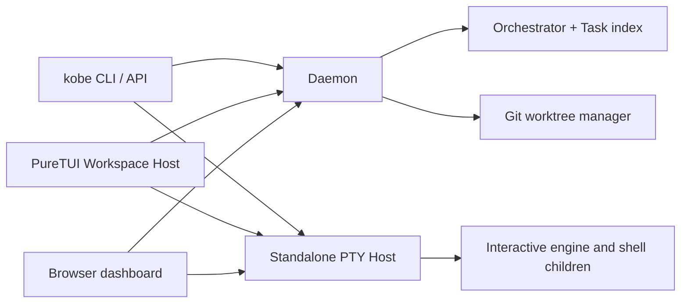

# Architecture

## 1. System shape



The Daemon owns control-plane state. The PTY Host independently owns
interactive processes. This separation is load-bearing: a GUI exit or daemon
restart must not end engine sessions.

The product unit is:

```text
Task = git worktree + hosted engine sessions + branch
```

## 2. Package map

- `packages/kobe/` — published CLI and PureTUI.
  - `src/cli/` — command routing, help, API handlers, daemon and PTY-host
    process entrypoints.
  - `src/engine/` — engine registry, command/capability/history adapters,
    protocols, turn detection, and shared session launch composition.
  - `src/orchestrator/` — Task index and Worktree lifecycle.
  - `src/client/` — framework-free remote Orchestrator client and channel
    stores.
  - `src/tui/` — framework-free keymap, state, terminal, file, sidebar, and
    workspace cores.
  - `src/tui-react/` — the only UI implementation: React 19 over opentui.
- `packages/kobe-daemon/` — Unix-socket daemon protocol/server, browser
  transport, and standalone PTY Host implementation.
- `packages/kobe-web/` — browser dashboard SPA and browser-side PTY transport.
- `packages/kobe-desktop/` — desktop wrapper.
- `packages/branding/` — Remotion assets and checked-in replay rendering.

## 3. Launch and lifetime

Plain `kobe` starts `src/tui/index.tsx`, which dynamically loads the React
Workspace Host. Startup has one behavior; there is no launch-mode parser or
environment switch.

The Workspace Host connects as a daemon GUI client and attaches to hosted PTY
sessions. On exit it detaches local consumers. It does not kill children.

The Daemon is refcounted by attached GUI clients and browser streams. A daemon
idle exit leaves the PTY Host untouched. The PTY Host idle-exits only when it
owns zero live sessions.

Tmux is not a session backend. The CLI retains one quarantined compatibility
seam solely for upgrades from pre-v0.8: `kobe doctor` reports processes still
owned by the retired `tmux -L kobe` server, and `kobe reset` terminates those
pane process groups before stopping that server.

## 4. Hosted session addressing

Each Terminal Tab uses `<taskId>::<tabId>`. The initial engine tab is
deterministically `<taskId>::tab-1`; API liveness, delivery, and teardown use
the same address.

`src/engine/session-launch.ts` is the canonical launch builder. It owns shell
quoting, repository init scripts, engine argv/protocol, resume context, and
first-prompt priority. Both the Workspace Host and headless API automation call
it.

`kobe api send`, prompted `add`, and `fan-out`:

1. ensure the Worktree;
2. ensure the PTY Host;
3. reuse an alive canonical engine session, or open `tab-1` once;
4. deliver the prompt and detach the short-lived client.

The PTY Host's key-level `pty.open` idempotence prevents concurrent callers
from creating duplicate children.

## 5. Ownership boundaries

- Engine adapters own identity, launch commands, capabilities, models,
  history, completion markers, and telemetry normalization.
- The Orchestrator owns Task metadata and git Worktree mutations, not engine
  children.
- The Daemon is the Task-index writer and channel publisher, not the terminal
  process owner.
- The PTY Host owns child lifetime and buffered terminal bytes, not Task
  metadata.
- React components render and wire events; reusable policy/state belongs in
  framework-free `src/tui/**` modules.

## 6. State

- Task index: `<KOBE_HOME>/.kobe/tasks.json`
- UI/settings state: platform config home, normally
  `~/.config/kobe/state.json`
- Daemon socket/pid/log: derived from `KOBE_HOME_DIR`
- PTY Host socket/pid/log: derived independently from the same home
- Engine conversation history: engine-owned locations such as
  `~/.claude/projects/**`

Never treat browser storage as authoritative for local product state.

## 7. Reference projects

`refs/` is gitignored and read-only study material. Consult the relevant
project before changing a boundary it demonstrates:

- `agent-deck` — multi-session/task ergonomics
- `opcode`, `codexui` — coding-agent UI patterns
- `codex` — Codex CLI protocols and history
- `claude-code` — interactive engine behavior
- `ccstatusline` — terminal status presentation
- `warp` — terminal interaction and layout patterns

Reference code informs decisions but is never edited or copied wholesale.
