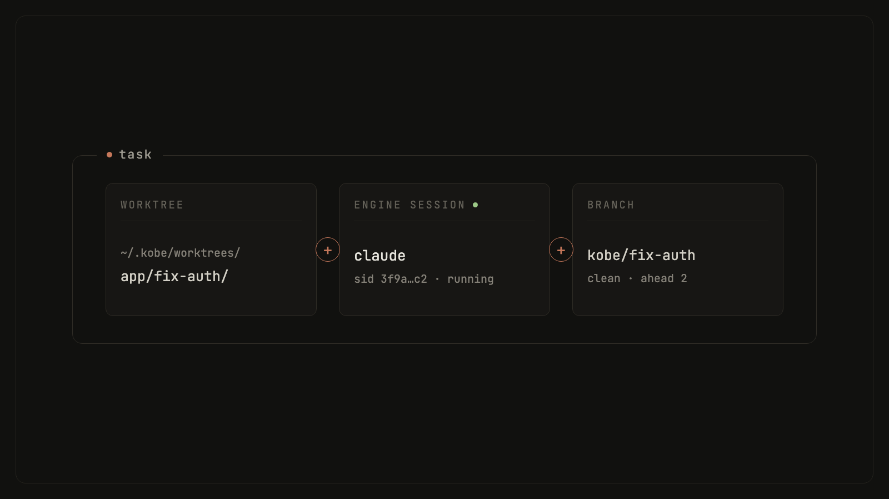
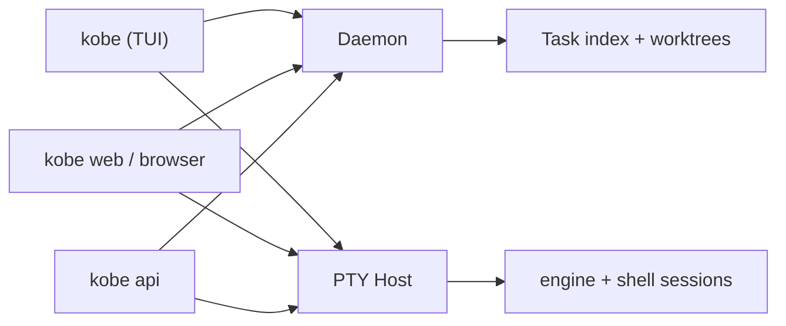

# Concepts

The mental model for kobe. Five nouns: Task, Worktree, Engine, Daemon,
PTY Host. The rest reads itself. Implementation detail lives in
[`ARCHITECTURE.md`](./ARCHITECTURE.md) and [`design/tasks.md`](./design/tasks.md);
this page is the user-facing version.

## Task

A Task is one unit of work you are tracking. The product unit is:

```text
Task = git worktree + hosted engine session + branch
```



A Task is a **workspace, not a conversation**. It is anchored to one repo,
owns one worktree checked out to one branch, and holds one or more chat
tabs. Tasks live in `~/.kobe/tasks.json`, a manifest, not a database. The
manifest stores metadata (title, repo, branch, status, model, permission
mode), never messages.

A Task has a `status` you set explicitly (`backlog`, `in_progress`,
`in_review`, `done`, `error`) and an orthogonal `archived` flag. Archiving
is non-destructive: the worktree and the conversation history stay; only
the task's live sessions stop and the sidebar moves it to Archives. kobe
never deletes a worktree implicitly, not on archive, not on `done`. You
remove worktrees explicitly or not at all.

### Primary and subagent Tasks

`prefix+@` links the focused Task to one existing Task as a subagent. The
relationship is directed: the focused Task is the primary and remains the
user-facing coordinator; the selected Task is a worker. Kobe persists the
primary Task id on the subagent record, but it does not fork either engine
session or create a shared Channel transcript.

The primary and subagent communicate in full engine turns through explicit
`kobe api send --task-id …` calls. The injected delegation bootstrap and the
installed Kobe skill supply both ids and the request/reply envelope. Each Task
continues to own its own worktree and native engine history.

## Worktree and branch

Every Task gets its own git worktree, at
`~/.kobe/worktrees/<repo-key>/<task-slug>/`, checked out to the task's
branch. This is what makes parallelism safe: N tasks in flight means N
working trees that cannot stomp each other or your main checkout. Edits in
one task appear in another only when you merge branches.

The worktree outlives everything else. Killing an engine session, quitting
the TUI, dropping SSH, restarting the daemon: none of these touch the
worktree. It persists across kobe restarts and across archiving.

One boundary to know: when several chat tabs share a task's worktree, kobe
does **not** coordinate their writes. If two tabs edit the same file at
once, that is your problem: there is no locking, no per-tab staging, no
three-way merge. The escape hatch is "open a new task", which gets a fresh
worktree.

## Chat tabs and engine sessions

A Task owns N chat tabs. Each tab is one engine session with its own
conversation transcript and its own `sessionId`, which is what the engine's
resume mechanism keys off. Tabs exist so you can peel a side question off a
long-running conversation without polluting its transcript. Close the tab
when exhausted, keep the worktree.

Per-task settings (engine, model, permission mode) apply to all tabs
equally. If you want a different model, you want a different task.

Conversation history is the engine's own on-disk store (for Claude Code,
the JSONL transcripts under `~/.claude/projects/**`); kobe reads it back
through the engine adapter on demand. That is why a crash mid-stream loses
no transcript: the JSONL is the source of truth, `tasks.json` is just a
manifest.

## Engines

Engines are execution backends. kobe embeds the **real interactive engine
CLI**: `claude`, `codex`, `copilot`, `kimi`, or any command you register
yourself (see `kobe config`), running it as an interactive process inside a
hosted PTY session, picked per task. No API wrappers, no re-rendered
streams: what you see in the workspace pane is the actual engine CLI running
next to your dependencies, services, and credentials.

The engine adapter is the source of truth for everything engine-shaped:
identity, launch command, model catalog, capabilities, history, telemetry.
Neutral layers (TUI, web, orchestrator) never hard-code vendor strings or
parse vendor transcript files themselves.

## The three processes

kobe runs as three kinds of process, and the split is the reason sessions
survive you:



- **The daemon** is a per-user singleton that owns control-plane state: the
  task index, worktree lifecycle, the issue store, and the event channels
  every client subscribes to. It auto-spawns on first use and self-stops
  when its last GUI client disconnects (grace `KOBE_DAEMON_IDLE_GRACE_MS`,
  default 3s). It listens on a Unix socket at `~/.kobe/daemon.sock` and is
  managed with `kobe daemon status|start|stop|restart`.
- **The PTY host** is a separate long-lived process that owns the actual
  child processes: every engine and shell session. It outlives both the
  TUI *and* the daemon: a daemon restart must never end running engine
  sessions, so `kobe daemon restart` leaves the PTY host untouched, and the
  PTY host exits only when it owns zero live sessions. (`kobe pty-host` is
  its internal entrypoint, spawned detached on demand.)
- **The TUI** is a pure attach client. Plain `kobe` connects to the daemon
  as a GUI client and attaches to hosted PTY sessions; on exit it detaches
  and kills nothing. Close the laptop lid, drop the SSH connection,
  `ctrl+q` out. Reopen and every session is where you left it.

The litmus test for where any piece of state lives: *if I close terminal 1
and open terminal 2, should it survive?* Yes → daemon (task list, status,
issues). It's a live process → PTY host. No → TUI-local (cursor, focus,
composer draft).

## The issue store

kobe has no external issue tracker. The backlog is a daemon-owned issue
store at `~/.kobe/issues.json`, keyed by each repo's git common-dir, so a
source checkout and all its task worktrees share one issue record.

Deliberately low-ceremony: no type taxonomy, just a `status`
(`open → doing → done`), plus `hold` as a parking lot for issues parked on
purpose. Issues are how agents file work for themselves and for you:

- You: the Issues page on the `kobe web` dashboard, or the Kanban in the TUI.
- Agents and scripts: `kobe api issue-list`, `kobe api issue-create`,
  `kobe api issue-set-status`, `kobe api issue-update`.

Issues are the backlog of *what to do*; the changelog is the record of
*what shipped*. They are different things.

## Where things live on disk

| What | Where |
|---|---|
| Task index | `~/.kobe/tasks.json` |
| Per-task worktrees | `~/.kobe/worktrees/<repo-key>/<task-slug>/` |
| Issue store | `~/.kobe/issues.json` |
| Daemon socket / pid / log | `~/.kobe/daemon.sock`, `~/.kobe/daemon.log`, … |
| UI/settings state | `~/.config/kobe/state.json` (edit via `kobe config`) |
| Engine conversation history | engine-owned, e.g. `~/.claude/projects/**` |

Everything above keys off `KOBE_HOME_DIR` when it is set. That is how the
dev sandbox runs against a throwaway home instead of your real `~/.kobe`.

## Typical workflows

**Local multi-task fan-out.** Press `n` in the TUI, pick repo, base branch,
and engine; or script it headlessly. One prompt, N isolated attempts:

```bash
kobe api fan-out --repo "$PWD" \
  --agents claude:2,codex:2 \
  --prompt "Try independent approaches to simplify the auth flow."
```

Each attempt is its own Task with its own worktree. Workers report
outcomes with `kobe api report`; you supervise with `kobe api await`,
observe with `kobe api read-output`, compare with `kobe api collect`, and
land the winner with `kobe api land`.

**SSH into a host and run kobe there.** kobe runs where your code lives:
a devbox or VPS you SSH into. The daemon and PTY host live on that machine,
so closing your laptop or dropping the connection kills nothing. SSH back
in, run `kobe`, and every session is where you left it. Notifications and
clipboard ride SSH back to your local terminal.

**The web dashboard as a second client.** `kobe web` serves a local
dashboard on the same daemon the TUI uses (default
`http://localhost:5174`), so both surfaces stay in sync: same tasks, same
issue store. Keep the TUI in a terminal and the dashboard in a browser tab
for the Issues board, or check in on long-running tasks without a terminal.

## Glossary

- **Task**: one tracked unit of work: a (worktree, branch, chat tabs)
  triple, anchored to one repo.
- **Worktree**: a git worktree on disk, checked out to the task's branch.
  1 per task, never auto-deleted.
- **Chat tab**: one engine session inside a task, with its own
  `sessionId` and transcript. N per task.
- **Engine**: an interactive coding-agent CLI (`claude`, `codex`,
  `copilot`, `kimi`, or a command you registered) that kobe runs as the
  task's execution backend.
- **Hosted PTY session**: an interactive engine or shell process owned by
  the PTY host, addressed as `<taskId>::<tabId>`.
- **Daemon**: the per-user control-plane process: task index, worktrees,
  issue store, event channels. Auto-spawns, refcounted by attached clients.
- **PTY host**: the separate process that owns all live engine/shell
  sessions; survives TUI exit and daemon restart.
- **TUI / Workspace Host**: the terminal UI, a pure attach client of the
  daemon and PTY host.
- **`kobe api`**: the headless client surface for scripts and other agents
  (fan-out, report, await, read-output, collect, land, issue verbs).
- **Issue store**: the daemon-owned backlog at `~/.kobe/issues.json`,
  shared across a repo and its worktrees.
- **Fan out / fan in**: running N isolated attempts of one prompt, then
  comparing and merging the winner.
