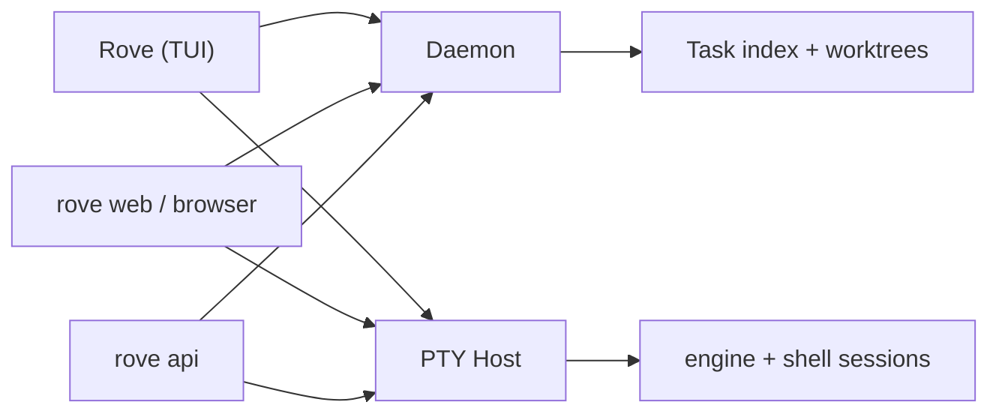

# Concepts

Five nouns explain Rove: **Task**, **Worktree**, **Engine**, **Daemon**,
**PTY host**. Learn those and the rest reads itself.

## Task

A Task is one unit of work you're tracking:

```text
Task = git worktree + engine session + branch
```


A Task is a **workspace, not a conversation**. It belongs to one repo, owns
one worktree on one branch, and holds one or more chat tabs.

Each Task has a `status` you set yourself — `backlog`, `in_progress`,
`in_review`, `done`, `error` — and a separate `archived` flag.

**Archiving is safe.** It stops the task's live sessions and moves it to
Archives. The worktree and the conversation stay. Rove never deletes a
worktree on its own — not on archive, not on `done`.

## Worktree and branch

Every Task gets its own git worktree at
`~/.rove/worktrees/<repo-key>/<task-slug>/`, checked out to the task's
branch. That's what makes running many tasks at once safe: N tasks means N
working trees that can't overwrite each other or your main checkout. Edits
cross over only when you merge.

The worktree outlives everything else. Killing a session, quitting the TUI,
dropping SSH, restarting the daemon — none of them touch it.

> **One thing to watch:** chat tabs inside the same task share one worktree,
> and Rove does not coordinate their writes. Two tabs editing the same file
> at once will conflict. If you need real isolation, open a new task.

## Chat tabs and engine sessions

A Task owns N chat tabs. Each tab is one engine session with its own
transcript and `sessionId`. Tabs let you ask a side question without
polluting a long conversation — close the tab when you're done, keep the
worktree.

Each tab pins the engine it starts with, so tabs in one task may use different
engines. Model and permission mode remain task-level; open a different task
when you need a separate worktree or different task settings.

Conversation history belongs to the engine, not to Rove (Claude Code keeps
JSONL transcripts under `~/.claude/projects/**`). That's why a crash never
loses a transcript.

## Engines

An engine is the execution backend a task runs on. Rove embeds the **real
interactive CLI** — `claude`, `codex`, `copilot`, `kimi`, or one you register
yourself — inside a hosted terminal session. No API wrappers, no re-rendered
output: what you see is the actual engine running next to your dependencies
and credentials.

Details: [Engines](ENGINES.md).

## Daemon and PTY host

rove splits into three processes, and that split is why your sessions
survive you:



- **Daemon** — owns your task list, worktrees, and the issue store. Starts on
  its own, then stops after the last attached GUI disconnects unless an
  enabled routine — or any live tab session in the PTY host — holds it alive
  (it must stay up to collect engine activity, or the status dots go stale).
- **PTY host** — owns the running engine and shell processes. Survives both
  the TUI *and* a daemon restart.
- **The TUI** — just a viewport. Quitting it kills nothing.

Full lifetime rules, and exactly what survives a reboot:
[Sessions](SESSIONS.md).

## The issue store

rove has no external issue tracker. Your backlog lives in a daemon-owned
store at `~/.rove/issues.json`, shared between a repo and all its worktrees.

It's deliberately simple — no type taxonomy, just a status
(`open → doing → done`, plus `hold` for things parked on purpose):

- **You:** the Issues page in `rove web`, or the Kanban in the TUI.
- **Agents and scripts:** `rove api issue-list`, `issue-create`,
  `issue-set-status`, `issue-update`.

Issues track *what to do*; the changelog records *what shipped*.

## Where things live on disk

| What | Where |
|---|---|
| Task index | `~/.rove/tasks.json` |
| Worktrees | `~/.rove/worktrees/<repo-key>/<task-slug>/` |
| Issue store | `~/.rove/issues.json` |
| Daemon socket / log | `~/.kobe/daemon.sock`, `~/.kobe/daemon.log` |
| Settings | `~/.config/rove/state.json` (open with `rove config`) |
| Conversation history | engine-owned, e.g. `~/.claude/projects/**` |

Setting `ROVE_HOME_DIR` moves all of it; `KOBE_HOME_DIR` remains a fallback.
That's how the dev sandbox avoids touching your real `~/.rove` product data or
`.kobe` compatibility runtime.

## Three ways people use it

**Many attempts at one prompt.** Press `n` in the TUI, or script it:

```bash
rove api fan-out --repo "$PWD" \
  --agents claude:2,codex:2 \
  --prompt "Try independent approaches to simplify the auth flow."
```

Each attempt is its own Task with its own worktree. Workers message their
outcome back to the spawning agent's chat tab (`rove api send`); compare
with `rove api collect`, merge with `rove api land`.

**Over SSH, on the machine your code lives on.** The daemon and PTY host run
on that machine, so closing your laptop kills nothing. SSH back in, run
`rove`, everything's still there. Notifications and clipboard ride the SSH
connection back to your local terminal.

**The web dashboard as a second screen.** `rove web` serves a local dashboard
(default `http://localhost:45174`) backed by the same daemon, so the TUI and
the browser always agree.

## Glossary

- **Task** — one worktree + branch + chat tabs, in one repo.
- **Worktree** — a git worktree on disk. One per task, never auto-deleted.
- **Chat tab** — one engine session inside a task. N per task.
- **Engine** — the coding-agent CLI a task runs on.
- **Daemon** — the background process holding your task list and issues.
- **PTY host** — the process holding live sessions; survives daemon restarts.
- **`rove api`** — the headless surface for scripts and agents.
- **Fan out / fan in** — run N attempts of one prompt, then merge the winner.
