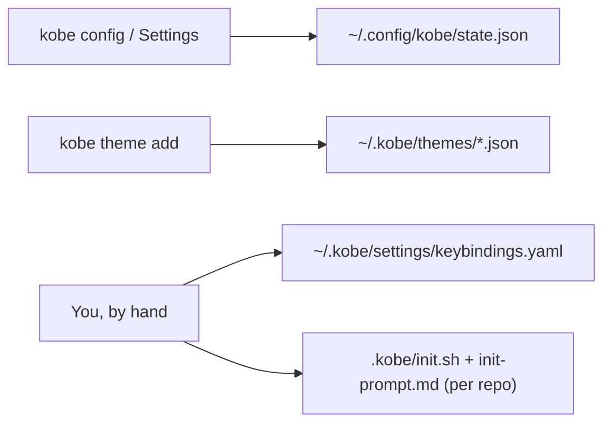

# Configuration

kobe's configuration is a small set of files under your home directory plus a
per-repo init hook. Most of it is written for you by the Settings dialog
(`ctrl+,`). This document is the map of what lives where, the supported way
to edit it by hand, and the verified key reference.

## Where configuration lives



| Path | Contents | Written by |
|---|---|---|
| `~/.config/kobe/state.json` | Flat JSON key/value store: theme, locale, editor, engine, notification, and UI prefs | kobe itself (Settings, CLI); hand-editable via `kobe config` |
| `~/.kobe/themes/*.json` | User-installed themes | `kobe theme add`, or drop files in by hand |
| `~/.kobe/settings/keybindings.yaml` | Hand-authored keybinding overrides | You |
| `<repo>/.kobe/init.sh` + `<repo>/.kobe/init-prompt.md` | Per-repo worktree init hook + first engine prompt | You (committed to the repo) |

All `~/.kobe` and `~/.config/kobe` paths honor `KOBE_HOME_DIR`, which replaces
`os.homedir()` for everything kobe persists (tests and the dev sandbox use it
to isolate state).

### state.json semantics

`state.json` is a single flat JSON object shared by every kobe process (the
TUI, pane subprocesses, the CLI). Two behaviors worth knowing before editing
it by hand (`src/state/store.ts`):

- **Writes are read-merge-write.** Every writer re-reads the file fresh and
  patches only the keys it owns, so concurrent kobe processes don't clobber
  each other. Same-key writers are last-write-wins.
- **Corrupt files are backed up, not deleted.** Unparseable JSON is renamed
  to `state.json.corrupt-<timestamp>`, a warning goes to stderr once, and
  kobe starts from `{}`. A missing file reads as `{}` silently.

Unknown keys are ignored, and most readers validate and fall back to defaults
on bad values, so a hand edit can't wedge the app. Worst case, a preference
resets.

## Editing with `kobe config`

```sh
kobe config          # open state.json in your editor
kobe config --path   # print the file path and exit
```

`kobe config` seeds an empty `{}` on first run so your editor opens valid
JSON, then resolves an editor in this order (`src/cli/config-cmd.ts`):

1. `$VISUAL` / `$EDITOR`
2. Your configured editor (`editor.kind` / `editor.customCommand`, see the
   reference below)
3. The first installed of `nvim` → `vim` → `emacs` → `nano`

The editor takes over the TTY and `kobe config` exits with its status. kobe
re-reads the file on its next launch; running processes pick up most pref
changes at their next decision point, but a restart is the reliable way to
apply a hand edit everywhere.

## state.json reference

Every key below is read in the kobe source; the validation behavior described
is what the reader actually does. Keys not listed here are internal UI state
(`savedRepos`, tab layouts, …) and live in the same file but aren't a
configuration surface.

### Appearance

| Key | Type | Default | Notes |
|---|---|---|---|
| `activeTheme` | string (theme name) | `"claude"` | Must name a bundled or installed theme; unknown names fall back to the default. See [Themes](#themes). |
| `transparentBackground` | boolean | `true` | Default-true: only an explicit stored `false` opts out. |
| `focusAccent` | `"primary"` \| `"success"` \| `"info"` | `"primary"` | Which palette slot paints the focused-pane indicator. |
| `appearance.splitStyle` | `"box"` \| `"line"` | `"box"` | How split leaves are framed. `box` draws a full frame per leaf (matching the workspace's bordered columns); `line` is the tmux-style minimal look — each leaf draws only the edge it shares with its previous sibling. Unknown values fall back to `box` (`src/state/split-style.ts`). |
| `locale` | `"en"` \| `"zh"` | `"en"` | UI language. Unknown values fall back to English. |
| `hints.keyboard.enabled` | boolean | `true` | Master switch for the keyboard-discoverability hints (status-bar micro-hint + first-use pane hints). Only an explicit `false` turns them off; re-enabling relights pane hints that were extinguished by use. Settings → General → Keyboard hints. |

### Editor

Used by the file tree's `e` key, `prefix+o` (open worktree in editor), and
`kobe config` itself (`src/tui/lib/editor-prefs.ts`, `editor-launch.ts`).

| Key | Type | Default | Notes |
|---|---|---|---|
| `editor.kind` | `"auto"` \| `"vim"` \| `"nvim"` \| `"nano"` \| `"emacs"` \| `"custom"` | `"auto"` | `auto` honors `$VISUAL` / `$EDITOR`, else auto-detects the first installed of nvim → vim → emacs → nano. |
| `editor.customCommand` | string | unset | Command for `kind: "custom"`, e.g. `code -w`. `{file}` in the string is replaced by the quoted file path; without it the path is appended. |

### Engines

| Key | Type | Default | Notes |
|---|---|---|---|
| `defaultVendor` | string (engine id) | unset → `"claude"` | Global default engine for new tasks (Settings → Engines). |
| `lastActiveVendor.<repo>` | string (engine id) | unset | Per-project last-used engine; outranks `defaultVendor` for that repo. Written by engine picks, not meant to be hand-edited. |
| `engineCommand.<id>` | string | built-in argv | Launch-command override for engine `<id>`, e.g. `"engineCommand.claude": "claude --model opus"`. Parsed shell-ish: single/double quotes group arguments. Empty/unset → the engine's built-in default. |
| `engineName.<id>` | string | built-in label | Display-name override for engine `<id>`. Clear both `engineName.<id>` and `engineCommand.<id>` to reset an engine to default. |
| `customEngineIds` | string[] | `[]` | Registry of user-added engine ids. See [Custom engines](#custom-engines). |

### Terminal

| Key | Type | Default | Notes |
|---|---|---|---|
| `terminal.scrollbackRows` | number | `1000` | Rows of history per embedded terminal's xterm buffer. Clamped between 100 and 100,000; non-numeric values reset to the default. Applies to terminals spawned **after** the change; live PTYs keep the buffer they were born with (`src/state/scrollback.ts`). |
| `chat.tabStrip.mode` | `"always"` \| `"multipleOnly"` \| `"never"` | `"never"` | Horizontal chat tab strip. Off by default because the sidebar tree already lists every worktree's tabs, so the strip is a second copy of the same list. `always` brings it back for every tab count; `multipleOnly` shows it only once a task has more than one tab (`src/state/tab-strip.ts`). |
| `chat.tabStrip.hideSingle` | boolean | unset | **Legacy** boolean that `chat.tabStrip.mode` replaced (`true` meant "hide while a task has one tab"). Still honored when the new key was never written, so an old setting keeps working; the moment you touch `chat.tabStrip.mode` the new key wins for good. |

### Notifications

All three default to `true` (only an explicit `false` opts out). Details in
[Notifications and sound](#notifications-and-sound).

| Key | Type | Default | Notes |
|---|---|---|---|
| `notifications.toast.enabled` | boolean | `true` | In-TUI completion toasts. **Error toasts always show** regardless of this switch. |
| `notifications.sound.enabled` | boolean | `true` | Audible chime when a background tab leaves `running`. |
| `notifications.crossTask.enabled` | boolean | `true` | Toasts for attention-worthy transitions on tasks you aren't looking at. |

### Sidebar

| Key | Type | Default | Notes |
|---|---|---|---|
| `activeSortMode` | `"recent"` \| `"default"` | `"default"` | Sidebar task ordering, read at startup. `recent` reshuffles as you switch tasks (jump digits follow); `default` is the stored, stable order. **Hand-edit only today**: the `t` chord that flips it (`sidebar.sort`) is in the keymap table but has no handler in the current TUI, so nothing in the UI writes this key. |

### Zen mode

Zen hides the files/Ops pane and the terminal pane across every chat tab so
each engine pane fills its window. Both keys are read fresh at each toggle, so
a hand edit needs no daemon restart (`src/state/zen.ts`).

| Key | Type | Default | Notes |
|---|---|---|---|
| `zen.active` | boolean | `false` | Global on/off intent. Persisted rather than per-session so switching projects doesn't drop you out of zen; entering any session reconciles its layout to this flag. Toggle with `prefix+z`. |
| `zen.keepTasks` | boolean | `true` | Whether zen keeps the Tasks rail. Default on so the create-PR bar and the prefix chord stay reachable to leave zen again. |

### Worktree location

By default every LOCAL task worktree lands under
`~/.kobe/worktrees/<repo-key>/<slug>`. These keys relocate that root
wholesale; the per-repo `<repo-key>` namespacing is preserved either way, so
worktrees from different repos never collide under a shared base. Read fresh
on every worktree-path computation — changing it takes effect for the next
task with no daemon restart, and **only new tasks move** (existing tasks keep
their persisted `worktreePath`, and the old default root stays recognized).
Remote (SSH) projects are unaffected: their worktrees live on the remote host
under the project's own base path. Settings → General → Worktree location
(`src/state/worktree-base.ts`).

| Key | Type | Default | Notes |
|---|---|---|---|
| `worktree.basePath` | string | `""` (→ `~/.kobe/worktrees`) | Absolute path, or a value starting with the `$project_dir` token, which expands to the task's project root at path-computation time — one global setting that yields a per-project layout. `$project_dir/..` is the "next to project" preset (worktrees land beside each repo). The token is only recognized as the **leading** segment; anywhere else it is a literal directory name. |
| `worktree.basePath.custom` | string | unset | TUI-only companion that remembers the last custom path you typed, so cycling the setting away from `custom` and back restores it instead of forcing a retype. The daemon never reads it. |

### Experimental

Off by default; the `experimental.` prefix means the behavior can change
without notice.

| Key | Type | Default | Notes |
|---|---|---|---|
| `experimental.remoteProjects` | boolean | `false` | Remote (SSH) projects. |
| `experimental.autoStatus` | boolean | `false` | Auto status flow: `turn-start` moves a backlog task to `in_progress`, and spawned sessions get a system-prompt protocol to self-report `in_review` (`src/state/auto-status.ts`). |
| `experimental.dispatcher` | boolean | `false` | Per-repo dispatcher: field notes filed by worktree sessions are routed by the repo's main session (`src/state/dispatcher.ts`). |
| `experimental.archivedHistoryPreview` | boolean | `false` | Read-only engine-history view for archived tasks. The web settings API mirrors this key and the TUI settings dialog can toggle it (`src/state/archived-history.ts`). |

## Themes

Full guide: [`docs/themes.md`](./themes.md). The short version:

- kobe ships bundled themes (`catppuccin`, `claude`, `conductor`, `dracula`,
  `gruvbox`, `nord`, `opencode`, `osaka-jade`, `rose-pine`, `tokyonight`).
- Drop `<name>.json` files into `~/.kobe/themes/` to add your own. No
  recompile; they load at boot. A user theme with the same name as a bundled
  one wins.
- CLI: `kobe theme list`, `kobe theme add <url|path> [--name N] [--force]`,
  `kobe theme remove <name>`.
- The active theme is the `activeTheme` key in `state.json` (set it from
  Settings → General → Theme).

## Keybindings

Full reference: [`docs/KEYBINDINGS.md`](./KEYBINDINGS.md). The configuration
surface:

- Bare keys belong to the focused pane, frequent Kobe actions use a small
  one-press set, and the configured prefix opens an on-screen command map for
  less-frequent actions. `F1` presents the same live keymap in that order.

- Discoverability hints (Settings → General → Keyboard hints, default on):
  the status bar keeps a permanent `{prefix} commands · F1 help · [settings]`
  micro-hint, including inside the embedded terminal. The configured prefix is
  Kobe-owned there; all other unclaimed keys still pass through to the PTY. The
  sidebar/files panes each show a one-line first-use hint that extinguishes
  permanently once that pane's own keys are used. Every status-bar segment is
  clickable — the `[settings]` button opens Settings even from inside the terminal,
  where mouse clicks don't pass through. Turning the toggle back on relights
  extinguished pane hints. Every advertised chord follows live rebinds; an
  unbound prefix is released to the PTY and drops out of its hint.

- Edit `~/.kobe/settings/keybindings.yaml` (`.yml` accepted when `.yaml` is
  absent). This is a hand-authored file; kobe never writes it.
- Changes **reload live** through the daemon watcher; no restart needed.
  Read/parse problems surface as warnings in Settings → Keybindings.
- Override semantics (`docs/KEYBINDINGS.md` § User customization):
  - A direct override replaces the binding's complete direct-chord list;
    `null` or `[]` unbinds it.
  - `prefix:` overrides the prefix key itself (`key:`, `timeoutMs:`) and
    second-stroke keys; prefix bindings keep their original pane scope.
  - Platform overlays (`darwin:`, …) win per chord.
  - A `plugins:` section binds chords to installed plugin panes/actions.
    kobe ships no default plugin chords.
- Unknown binding ids and invalid entries are ignored with warnings. A typo
  in the file never breaks the default keymap.

## Notifications and sound

Notification kinds are `done` (green), `needs_input` (yellow), and `error`
(red), with yellow/red outranking green when both fire for the same tab
(`src/tui/lib/notify-state.ts`). Three delivery channels:

- **Toasts**: in-TUI, 4.5 s. Gated by `notifications.toast.enabled`, except
  error toasts, which always show (a failure must not vanish because you
  disabled completion popups).
- **Desktop notification**: kobe emits an OSC 9 escape, which iTerm2 /
  kitty / WezTerm / Ghostty render as a native OS notification; other
  terminals ignore it silently. Because it travels down the terminal stream,
  it reaches your local terminal even over SSH. There is no separate switch
  for this channel.
- **Sound** (`src/tui/lib/sound.ts`): a short chime when a background tab
  finishes, gated by `notifications.sound.enabled`. kobe probes `PATH` for
  the first available player (`afplay`, `ffplay`, `mpv`, `play`, `aplay`, …)
  and plays a bundled `pulse.wav` through it. With no player found it's a
  silent no-op and the terminal bell is the fallback.

## Engines

Built-in engines are `claude`, `codex`, `copilot`, and `kimi`
(`src/engine/registry.ts`). Per-engine behavior kobe knows about (model
catalogs, effort levels, transcript stores, account detection) is
engine-owned; neutral surfaces just use the registry entry.

### Custom engines

Register any other CLI as an engine from Settings → Engines: pick an id and
a launch command. Two `state.json` keys make it real:

```json
{
  "customEngineIds": ["aider"],
  "engineCommand.aider": "aider --model sonnet"
}
```

- `customEngineIds` is the registry: an id is "registered" by being in this
  list. Ids must match `^[a-z][a-z0-9_-]{0,47}$` and must not collide with a
  built-in id; entries that fail validation are filtered out on read
  (`src/core/daemon-settings-adapter.ts`).
- `engineCommand.<id>` is the launch command (required for anything useful;
  without it kobe falls back to running a bare binary named after the id).
- `engineName.<id>` optionally sets the display label; unset, the id itself
  is the label.

A custom engine gets a deliberately empty registry entry: no transcript
reader (auto-title keeps its placeholder instead of misreading another
vendor's files), no account detection, no activity hooks, and no completion
markers. It launches and runs like any other engine; kobe just doesn't
pretend to know its internals.

## Per-repo init

A repo can ship two files under its own `.kobe/` directory
(`src/state/repo-init.ts`):

- `.kobe/init.sh`: runs in each new task worktree before the engine starts
  (once per worktree; a marker under `~/.kobe/worktree-init/` gates re-runs).
- `.kobe/init-prompt.md`: sent as the engine's first prompt.

Repo files win over any per-user override. Use these for environment setup
(`bun install`, direnv, codegen) every task worktree needs.
