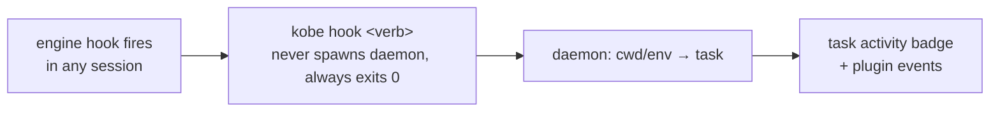

# Engines

An **engine** is the execution backend a task runs on: the interactive AI CLI
(`claude`, `codex`, `copilot`, `kimi`, or one you register) whose session lives
in the task's hosted PTY. `Task = git worktree + engine session + branch`; the
engine is the middle term.

Ground truth: [`packages/kobe/src/engine/registry.ts`](../packages/kobe/src/engine/registry.ts).
If this page and the registry disagree, the registry wins.

## The engine-owned contract

Per-vendor wiring lives in exactly one place: the engine registry. Every
built-in engine registers an entry exposing:

- `identity`: product/assistant names and copy (e.g. the composer placeholder
  `Ask Claude…`). Neutral layers (TUI, web, orchestrator) read these and must
  never hard-code vendor strings.
- `capabilities`: model catalog, permission modes, context-window math.
- `history`: a reader over the engine's on-disk transcript store (auto-title,
  recap, the Ops activity badge) plus an optional normalized `EngineTrace` and
  cheap revision token for structured execution UIs.
- `detectAccount`: a read-only binary + login probe (Settings → Accounts,
  `kobe doctor`).
- `createHookAdapter`: installs activity hooks into the engine's own config
  file so sessions report normalized events.
- `createTurnDetector`: turn-completion detection for the chat tab.
- `defaultCommand` / `displayName` / `effortLevels` / `terminalTitle` /
  `quotaUsage`: launch argv, labels, reasoning-effort flags, OSC title policy,
  and the subscription-quota probe.

Adding an engine means one new registry entry plus its vendor-local modules; no
neutral code names a vendor.

## Supported engines

| Engine | Id | Binary | Account detect | Hooks | History | Capabilities | Notes |
|---|---|---|---|---|---|---|---|
| Claude Code | `claude` | `claude` | ✓ | ✓ | ✓ | ✓ (models + permission modes) | The default. Quota probe drives rate-limit auto-resume + the Settings usage dashboard. |
| Codex | `codex` | `codex` | ✓ | ✓ (after trust) | ✓ | ✓ (model + effort levels) | Effort maps to `-c model_reasoning_effort=<level>` at launch. |
| GitHub Copilot | `copilot` | `copilot` | ✓ | no | ✓ | no | No wired hooks and no persisted turn-completion marker yet. |
| Kimi Code | `kimi` | `kimi` | ✓ | no | no | no | **Partial.** Binary + account detection only; see below. |

**Kimi is a partial engine.** The `kimi` binary is discovered (PATH, then
`~/.kimi-code/bin/kimi`) and its OAuth credential file is read, so it launches
and shows account state. But its on-disk session format
(`~/.kimi-code/sessions/wd_*/session_*/`) is unverified against a real
conversation, so it has **no history reader**. Auto-title keeps the placeholder
title, and `kobe api read-output` reports `engine_unsupported` rather than
mis-parsing. Hooks and turn detection are likewise no-ops.

**Custom engines** you register yourself get a documented *empty* entry: no
history, no account detection, no hooks, and a bare launch command (see
[Custom engines](#custom-engines)).

### Reasoning effort

Codex accepts kobe-driveable effort levels `none`, `low`, `medium`, `high`,
`xhigh`, appended as `-c model_reasoning_effort=<level>` (the broken `minimal`
level is deliberately excluded). Other engines have no kobe-driveable effort
flag. A selected effort on them is silently ignored, and an unknown level is
dropped rather than passed through.

### Terminal titles

Claude and Codex own their OSC title while visible (`terminalTitle.ownsStatus`),
so neutral tab chrome doesn't prefix a duplicate turn glyph. Codex additionally
launches with `-c tui.terminal_title=["activity","thread-title"]` so tabs show
its thread title instead of the repo name. Everywhere a live engine title is
displayed (tab labels, split corner tags) it collapses to the launch binary
(`✳ Claude Code` renders as `claude`), so all kobe surfaces speak one
vocabulary for a process. Vendor identity comes from the process tree, never
from matching the title string.

## Account and binary detection

Detection is **read-only**: kobe never writes to engine config for this, and
never shells out to a status subcommand. The on-disk files are the source of
truth those subcommands print anyway. Anything that isn't cleanly "logged in" /
"not logged in" (unreadable file, corrupt JSON, malformed JWT) surfaces as a
warning instead of pretending to be "not logged in".

| Engine | Account file read | What counts as logged in |
|---|---|---|
| `claude` | `$CLAUDE_CONFIG_DIR/.claude.json` (default `~/.claude.json`) | `oauthAccount.emailAddress` present |
| `codex` | `$CODEX_HOME/auth.json` (default `~/.codex/auth.json`) | `tokens.id_token` JWT (ChatGPT login, with plan claim) or a non-empty `OPENAI_API_KEY` |
| `copilot` | `$COPILOT_HOME/config.json` (default `~/.copilot/config.json`) | `COPILOT_GITHUB_TOKEN` / `GH_TOKEN` / `GITHUB_TOKEN` env, else a token-ish key in the config |
| `kimi` | `$KIMI_CODE_HOME/credentials/kimi-code.json` (default `~/.kimi-code/credentials/kimi-code.json`) | non-empty `access_token` (the JWT carries no email claim, so no email is shown) |

Where this shows up:

- **Settings → Accounts** renders the binary probe + account state per engine.
- **`kobe doctor`** prints the same probe for `claude`, `codex`, and `copilot`
  under its `engines:` block (`kobe doctor --report` additionally writes a
  `kobe-doctor-report.txt` bundle in the cwd). Doctor does not currently probe
  `kimi`.
- **The new-task dialog** hides engines whose CLI binary isn't installed (a
  `which`-style probe, memoized per process). Custom engines are always shown:
  "the user added it" counts as available, and a missing binary just fails to
  launch with a shell error.

## Hook integration

kobe learns what a session is doing (turn started/finished, rate-limited,
waiting on a permission prompt) from the engine's **own hook mechanism**, not
polling. Each engine's hook adapter translates vendor events into neutral verbs
and points them at `kobe hook <verb>`, an internal CLI subcommand that reports
the event to the daemon. The daemon maps the hook's `cwd` (or the inherited
`KOBE_TASK_ID` / `KOBE_TAB_ID` env vars) to a task and folds the event into the
task's activity badge.



Install is **default-on and global**: on every kobe launch,
`ensureGlobalKobeHooks` (in `src/cli/hook-cmd.ts`) writes kobe's hooks into each
hook-supporting engine's user-level config file. The merge is idempotent,
merge-safe (your own hooks for the same events are preserved; kobe replaces
only its own entries, identified by the `kobe hook` command substring), and
never blocks launch.

### Claude: `~/.claude/settings.json`

| Claude hook event | Neutral verb |
|---|---|
| `SessionStart` | `session-start` |
| `UserPromptSubmit` | `turn-start` |
| `Stop` | `turn-complete` |
| `StopFailure` | `turn-failed` (classified: rate limit / billing / other) |
| `Notification` (`permission_prompt`, `elicitation_dialog`) | `awaiting-input` |
| `SessionEnd` | `session-end` |
| `PreCompact` / `PostCompact` | `pre-compact` / `post-compact` |
| `SubagentStart` / `SubagentStop` | `subagent-start` / `subagent-stop` |
| `PreToolUse` / `PostToolUse` / `PostToolUseFailure` | `tool-pre` / `tool-post` / `tool-failed` (gated, see below) |

### Codex: `~/.codex/hooks.json`

Codex uses the same settings-file shape. Wired: `SessionStart`,
`UserPromptSubmit`, `Stop`, `SessionEnd`, `PreCompact`, `PostCompact`,
`SubagentStart`, `SubagentStop`, `PreToolUse`, and `PostToolUse`. **Not wired:**
`turn-failed` and `awaiting-input`. Codex's only waiting signal is
`PermissionRequest`, an allow/deny *decision* hook, and installing an observer
there could interfere with Codex's approval flow. The polling fallback covers
those states.

Codex also won't run a non-managed hook until you trust it once via `/hooks`
(or launch with `--dangerously-bypass-hook-trust`). kobe writes the definition
but never auto-bypasses trust, so Codex activity badges light up only after you
approve, by design.

### Copilot, Kimi, custom engines

No hook mechanism is wired (`NoopHookAdapter`); install is a no-op and nothing
is written to their config.

### The `tool.*` volume gate

The tool-family hooks fire on **every tool call of every session machine-wide**.
Codex tool hooks are always written because the Agent Trace needs exact call
IDs for its live overlay. Other engines retain the volume gate: their tool
hooks are written only while an enabled plugin declares a `tool.*` event hook
(`pluginsWantToolEvents` in `src/cli/hook-cmd.ts`, re-synced on every launch,
so installing or removing such a plugin takes effect on the next kobe start).
The other activity hooks are always installed.

### Worktree watch

A global `PostToolUse` (Bash) observer hook reports `kobe hook worktree-created`
after every Bash call; it no-ops fast unless the command was `git worktree add`
(adopt the new worktree as a task immediately) or `git worktree remove`
(archive the pinned task). This is a pure *observer* fired after the tool runs,
unlike the old `WorktreeCreate` *provider* hook (0.7.4-0.7.9) whose mere
presence broke `claude --worktree` everywhere. kobe removes any such legacy
hook it ever wrote; `kobe hook setup` survives only as a deprecated cleanup
no-op.

### Hook invocation contract

`kobe hook <verb>` is internal: engines fire it, you don't. Two guarantees are
load-bearing: it **never spawns the daemon** (an idle-stopped daemon means the
event is simply dropped), and it **always exits 0** (a hook must never fail the
engine's action).

## Activity state detection

The sidebar badge (working / done / needs-input) is fed by **three layers**,
merged hook-wins (`src/tui/workspace/turn-state-merge.ts`):

1. **Hooks** (claude, codex; see above). Authoritative while reporting: a
   hook-driven `engine-state` push supersedes anything the pollers conclude.
   `needs_input` is **hook-only**. No amount of polling can distinguish
   "waiting for a permission prompt" from "thinking".
2. **Turn detectors**: transcript-based completion detection per engine
   (`src/engine/turn-detector.ts`): `ClaudeTurnDetector` watches the JSONL
   transcript for assistant-message markers; `CodexTurnDetector` watches the
   rollout log for `task_complete` / `turn_complete` / `turn_aborted`. This
   covers hook-less or untrusted sessions of hook-capable engines.
3. **Quiescence/mtime fallback**: for engines with no markers (copilot) the
   daemon falls back to watching the latest transcript mtime; a session that
   goes quiet reads as done. Custom engines resolve to an empty history reader,
   so their badge stays dark. kobe labels the gap honestly rather than
   guessing state from screen scraping.

Because hook delivery can lapse (daemon restart, dropped event), a ~10-minute
watchdog caps how long a stale "working" badge survives without confirmation.
The poll loop runs every ~2 s against the daemon's shared transcript-activity
slice, and it also spots a hand-launched `claude` in a plain shell tab (via the
OSC window title) so even unmanaged sessions get a badge.

There is nothing to configure. The layers are automatic. The user-visible
consequence to remember: **only claude/codex sessions can ever show
needs-input**; every other engine tops out at working/done.

## Agent Trace

The `/chat` Agent Trace is a structured observability surface, not a second
conversation store and not a chain-of-thought viewer. Its neutral contract is
`EngineTrace`: turns contain engine-normalized nodes such as visible
commentary, reasoning summaries, tool calls, changes, answers, subagents, and
compaction. Every node carries a stable ID, status, timestamps, bounded detail,
and an explicit provenance for parent edges. A temporal neighbor is labelled
`temporal`; the UI never upgrades adjacency into proven causality. Retry links
and attempt numbers render only when an engine explicitly supplies them.

Codex currently provides the complete implementation. Its history adapter
parses rollout JSONL into persisted full snapshots, while its trusted hooks
publish low-latency lifecycle/tool/subagent events through the daemon. The web
client folds that ephemeral overlay by stable turn/call IDs, then replaces it
with the next persisted snapshot. Both SSE routes send replayable state on
connect, so a browser or daemon reconnect heals without the UI owning a delta
log. Claude and Copilot currently get a settled, generic trace from their
normalized message history; engines without readable history return an empty
trace rather than leaking vendor checks into the frontend.

```mermaid
flowchart LR
    A[Codex rollout JSONL] --> B[Codex history adapter]
    B --> C[EngineTrace snapshot SSE]
    D[Trusted Codex hooks] --> E[daemon live event rail]
    E --> F[stable-ID overlay]
    C --> F
    F --> G[/chat Agent Trace]
```

The terminal screen grammar remains separate: it translates PTY rows for the
center conversation view, while Agent Trace consumes only structured engine
output. To add another engine, implement `readTrace` (and optionally
`traceRevision` plus normalized live hook details) in that engine's registry
entry; do not add vendor parsing to React components.

## Launching and resuming sessions

Every launch site resolves the engine argv the same way
(`interactiveEngineCommand` in `src/engine/interactive-command.ts`):

1. Your `engineCommand.<id>` override from `state.json` (Settings → Engines), if
   set. It's a shell-ish command string. Quotes are honoured, so
   `claude --append-system-prompt "be terse"` and `--flag="a b"` both survive.
2. Otherwise the registry's `defaultCommand` (the bare binary).

Then, per engine:

- **Claude** gets a kobe-generated `--session-id <uuid>` appended, so the hosted
  session maps to its transcript and the tab can be auto-named from its first
  prompt, and later resumed. If your override already pins the conversation
  (`--session-id`, `--resume`/`-r`, `--continue`/`-c`, `--from-pr`), kobe leaves
  it alone.
- **Codex** gets the effort flag and the terminal-title args described above.
- Everything else launches bare.

**Resume.** A Claude tab that already conversed but whose PTY is gone (host
restart, unarchive) relaunches with `--resume <sessionId>` instead of opening a
blank session. The archived-task snapshot is kept precisely so unarchive can
resume the same conversation. A tab that spawned but never sent a first message
is *not* resumed: `--session-id` creates no transcript until the first message,
and `claude --resume` on a missing conversation errors out. Codex, Copilot,
Kimi, and custom engines can't take a caller-set session id, so their tabs
relaunch bare, with no resume.

**Fork a conversation.** `ctrl+a` `c` opens a new tab in the SAME worktree that
starts from the active tab's conversation and then diverges — parent and child
each keep their own transcript. Only engines whose CLI can BRANCH a session
support it (`canForkSession`):

`ctrl+a` `c` opens the engine picker, and the pick decides which of two shapes
runs.

**Same engine → a native fork.** The CLI reopens its own conversation and
branches it, so both sides keep full context with no copying:

| Engine | Fork | How |
|---|---|---|
| `claude` | ✓ | `--resume <src> --fork-session`, plus kobe's own `--session-id <new>` so the forked tab stays trackable/resumable |
| `codex` | ✓ | the `fork` subcommand: `codex fork [options] <src>`. Codex takes no caller-set id, so the fork's own session isn't tracked (same as any codex tab) |
| `copilot` | no | `--resume` only reopens the same session — two live processes on one transcript, not a fork |
| `kimi` | no | same: `-S/--session` and `--continue` only reopen |
| custom | no | kobe knows neither their flags nor their session store |

**Different engine → a handoff.** The one move that survives hitting a usage
limit mid-task: the target engine starts a FRESH session whose first prompt
names the previous engine, the worktree, and the absolute path of that
session's transcript, and tells it to read what it needs from there
(`src/engine/session-handoff.ts`). kobe never converts one vendor's transcript
into another's format — every engine can read a JSONL file, and a converter
would rot on both sides' format changes. The brief also marks the transcript as
untrusted historical data (it contains arbitrary tool output), makes the
working tree authoritative, and asks the new session to state where the old one
stopped — that sentence is how you verify the handoff landed.

A handoff needs the source engine to expose a transcript path
(`EngineHistoryReader.transcriptPath`): claude and codex do, so claude ⇄ codex
works in both directions. Copilot, Kimi and custom engines keep no transcript
kobe can name, so a handoff FROM them is refused with a reason; a handoff TO
them works, since the receiving side only needs to read a file.

If an engine exits non-zero, the hosted terminal stays open with a banner
pointing you at Settings → Engines to fix the launch command, and drops you
into your shell.

## Custom engines

Any CLI can be registered as an engine: a slug id plus a launch command.

**Via the UI:** Settings → Engines → **+ Add engine**. You're asked for an id
(lowercase slug, e.g. `aider`), a launch command (e.g. `aider --model sonnet`),
and an optional display name. The new engine appears in the new-task selector
and everywhere built-ins cycle. Pressing `x` on an engine row resets overrides
for a built-in, or removes a custom engine entirely.

**Via config:** the registration is three keys in kobe's shared `state.json`
(`kobe config` opens it in `$VISUAL`/`$EDITOR`; `kobe config --path` prints the
path):

```json
{
  "customEngineIds": ["aider"],
  "engineCommand.aider": "aider --model sonnet",
  "engineName.aider": "Aider"
}
```

- `customEngineIds`: the list of registered custom ids. Presence in this list
  *is* the registration; there is no other step.
- `engineCommand.<id>`: the launch-command override. For a custom engine this
  is effectively required (its fallback is a bare binary named after the id);
  for a built-in it overrides the default argv. Blank clears the override.
- `engineName.<id>`: a display-name override, for built-ins too.

What a custom engine gets (and doesn't): it launches in a hosted PTY with the
full keep-alive and repo-init treatment, but its registry entry is deliberately
empty: **no transcript reader** (auto-title keeps the placeholder rather than
mis-reading another vendor's files), **no account detection**, **no hooks**,
and an unknown turn detector. It also can't take a pinned session id, so no
resume.

## History (transcript readers)

Each engine with a verified on-disk format ships a reader behind the neutral
`EngineHistoryReader` contract: session ids for a worktree (oldest-first),
messages for a session id, and the newest transcript mtime (the Ops pane's
activity badge watches this):

| Engine | Transcript store |
|---|---|
| `claude` | `~/.claude/projects/<encoded-cwd>/<sessionId>.jsonl` |
| `codex` | `~/.codex/sessions/<YYYY>/<MM>/<DD>/rollout-<ts>-<uuid>.jsonl` |
| `copilot` | `~/.copilot/session-state/<id>/` (`workspace.yaml` records the cwd) |

Readers are best-effort: size-bounded, tolerant of corrupt entries, and they
never throw. A missing or unreadable transcript degrades to "no session"
rather than an error in the UI. Engines without a verified format (Kimi, custom
engines) share an explicit `EMPTY_HISTORY` sentinel so neutral code can label
the gap explicitly (`supportsStructuredHistory`, used by `kobe api read-output`)
instead of confusing "no reader" with "reader found nothing".
