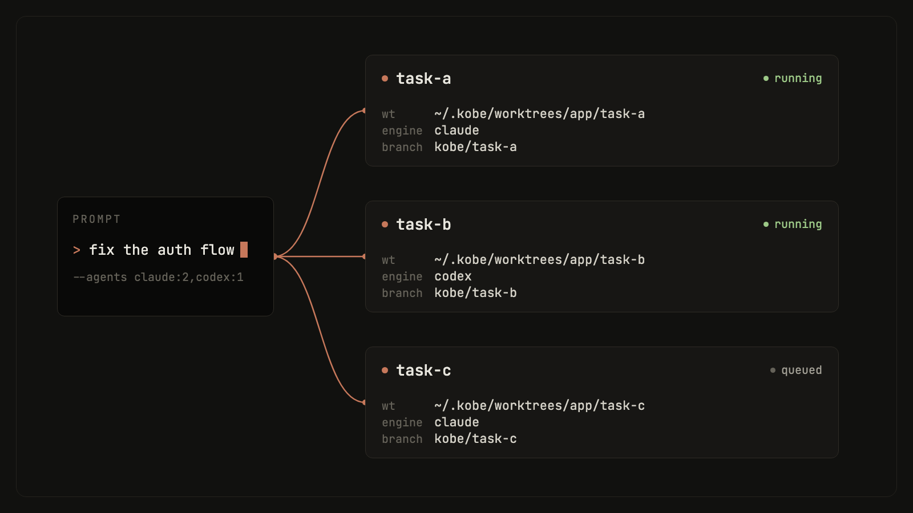

# Quick start

Requires [Bun](https://bun.sh) ≥ 1.3.11, git, and at least one engine CLI
(`claude`, `codex`, or `copilot`) on `PATH`.

## Install

```bash
bun install -g @sma1lboy/kobe

# or try it without installing
bunx @sma1lboy/kobe
```

## First run

```bash
ssh devbox        # optional — kobe runs wherever your code lives
cd your-repo
kobe
```

Press `n`, pick a repo, base branch, and engine, and prompt the embedded
session. The worktree lands in `~/.kobe/worktrees/<repo-key>/<task-slug>/`.

Press `F1` anytime for the live keybinding reference; `ctrl+q` focuses the
sidebar, and from there quits. Sessions keep running in the background.
Reattach later with plain `kobe` and the screen comes back.

The TUI is full-mouse: click to focus panes and sidebar rows, wheel to scroll
(forwarded to the engine when it asks for mouse input), drag to select.
Shift-drag bypasses mouse reporting for a native selection. When a background
session finishes or needs input, kobe raises a desktop notification (OSC 9,
which rides SSH back to your local terminal), plays a chime, and lights an
unread dot; `ctrl+a`, `i` opens the attention inbox across all tasks.

## Fan out from the shell

One prompt, N isolated attempts, one command:



```bash
kobe api fan-out --repo "$PWD" \
  --agents claude:2,codex:2 \
  --prompt "Try independent approaches to simplify the auth flow."
```

Compare the attempts, then land the winner:

```bash
kobe api collect --task-ids a,b,c      # read-only comparison snapshot
kobe api land --task-id a              # merge the winning branch
```

## Let your agent drive

Install the companion skill so your agent can orchestrate this loop itself:

```bash
kobe skill install
```

## If it gets stuck

```bash
kobe doctor            # read-only diagnosis: daemon, PTY host, engines, git
kobe doctor --report   # write a bundle you can attach to a bug report
```

More in [Troubleshooting](TROUBLESHOOTING.md).

## Next steps

- [Concepts](CONCEPTS.md): tasks, sessions, and what survives what.
- [CLI + API reference](CLI.md): every command and RPC verb.
- [Configuration](CONFIGURATION.md): engines, themes, notifications.
