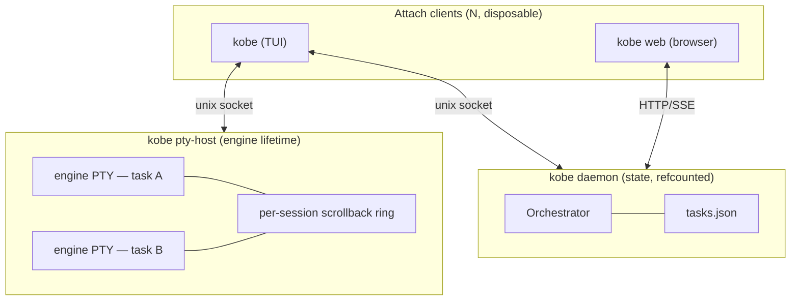
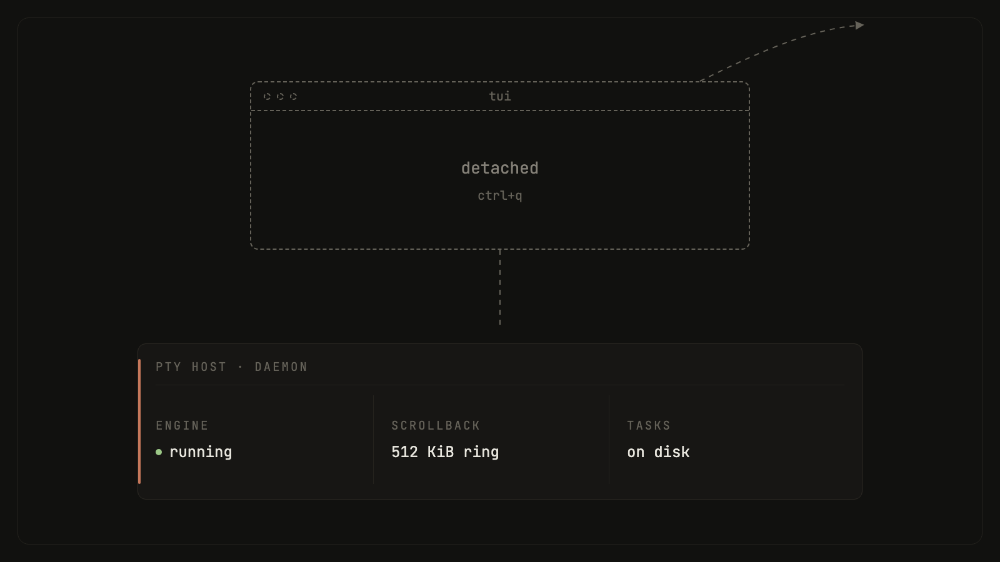

# Sessions: what survives what

kobe splits session state across three processes with different lifetimes.
Which one owns a piece of state decides what kills it.

- **TUI / web**: pure attach clients. Closing one touches nothing else.
- **Daemon** (`kobe daemon ...`): owns the task index, worktree records,
  and the event bus. Auto-spawns on first launch, self-stops once the last
  GUI client disconnects (grace `KOBE_DAEMON_IDLE_GRACE_MS`, default 3s).
  Restarts are routine: `kobe daemon restart` after code changes.
- **PTY host** (`kobe pty-host`, internal, spawned detached on demand, not
  listed in `kobe --help`): owns every embedded engine/shell process plus a
  per-session scrollback ring. Deliberately a separate process from the
  daemon, so a daemon restart never ends a running engine. Like the tmux
  server, it exits on its own only after a grace at zero live sessions
  (`KOBE_PTY_IDLE_EXIT_MS`, default 60s); `kobe reset` is the explicit
  teardown.

## What survives

| Case | Engine process | Recent scrollback | Task list + worktrees | Engine conversation |
|---|---|---|---|---|
| Quit the TUI | Keeps running (PTY host owns it) | Yes, from the host's ring | Yes | Yes, the process never stopped |
| Drop SSH | Keeps running | Yes, from the host's ring | Yes | Yes, reattach from a new SSH session |
| `kobe daemon restart` | Keeps running (host is a separate process) | Yes, ring untouched | Yes, reloaded from `tasks.json` | Yes, uninterrupted |
| Machine reboot, or `kobe reset` | No, the host dies with the machine / is torn down | No, the ring is in-memory only | Yes, from disk | Resumable from the engine's own transcript (see below) |

The first three rows are the point of the split: the TUI is a viewport, and
the daemon is replaceable state. The fourth row is the hard boundary:
nothing in kobe keeps processes alive across an OS reboot, and nothing
persists raw terminal output to disk.

## Detach / reattach model

There is no detach command. Quitting (`ctrl+q` from the sidebar, closing the
terminal, an SSH drop) *is* detaching: the client socket closes, the PTY
host stops fanning output to that connection, and the child keeps running.
Reattaching is running `kobe` again: a fresh TUI discovers background
sessions from the host (`pty.list`) and re-opens them by key
(`<taskId>::<tabId>`). On reattach the client's spawn spec is ignored when
the session already exists; the existing background session always wins.

Attach-time sync is **snapshot + tail**: the client loads the task list and
a tail of recent history, and older history pages in lazily on scroll. There
is no full-history replay, and there is no event-sequence replay
("events since seq=N"); that resilience polish is **deferred** (design
doc D4 in [design/daemon.md](./design/daemon.md)), so a reattached client
resyncs from snapshot.

Multiple clients can attach at once. PTY output delivery is targeted, not
pub/sub: the host fans each session's byte stream out to every connection
attached to it, and UI-local state (focus, cursor, composer draft) stays
per-client.

Two scoped exceptions to "everything survives a quit":

- Archiving a task kills its hosted sessions. A daemon janitor sweeps PTY
  sessions whose task is no longer live (`pty.sweep`), so a headless
  `kobe api task-archive` can't leak an engine that runs forever.
- An engine that exits on its own is kept as a dead session, scrollback
  intact, so a reattach still shows how it died, until an explicit close or
  the archive sweep removes it.

## Scrollback behavior and limits

Two different buffers, both bounded:

- **Host ring (what a reattach replays).** The PTY host keeps a capped byte
  ring per session, 512 KiB by default (`DEFAULT_SCROLLBACK_CAP` in
  `packages/kobe-daemon/src/daemon/pty-host.ts`), in-memory only. It stores
  raw bytes; VT emulation stays in the client, so "scrollback survives" means
  "the last ~512 KiB of output is replayed and your terminal re-derives the
  screen". When the host itself ends (reboot, `kobe reset`, idle-exit), the
  ring is gone.
- **Client xterm buffer (how far you scroll).** Settings → General →
  Terminal, key `terminal.scrollbackRows` in `~/.config/kobe/state.json`:
  default 1000 rows, clamped to 100 to 100 000. Applies to terminals spawned
  after the change; live terminals keep the buffer they were born with.

Reattach has a fast path. A TUI that hides a tab *parks* it: it serializes
the screen and records the host's monotonic byte offset plus the child's
pid. On wake, if that offset is still inside the ring window and the pid
still matches, the host replays only the bytes written since; the result is
bit-identical to never detaching. A trimmed-away offset or a respawned
session falls back to a full-ring replay. Attaching from a differently-sized
client resizes the session (last attach wins, like tmux), so a full-screen
app repaints at the new size.

## Engine session resume

Process survival and conversation survival are different things. The
conversation is the engine's own transcript on disk, and it outlives every
kobe process, including a machine reboot, because the engine writes it,
not kobe.

- Engine tabs pin their conversation up front: a Claude launch gets a
  kobe-generated `--session-id <uuid>` so the session maps to its transcript
  (vendors that can't take a caller-set id, like Codex, are left untouched).
- After a host restart (reboot, `kobe reset`), a persisted engine tab that
  already ran relaunches with `--resume <sessionId>` instead of opening a
  blank session. A tab found dead on attach gets **one** automatic resume
  attempt; if that dies too, the tab closes rather than respawning forever.
- `ctrl+a`, `y` opens the resume picker for the active task, the mirror of
  claude-code's `/resume`. It lists every persisted session in the task's
  worktree; selecting one focuses its tab if already open, otherwise opens a
  new tab seeded with that session id.

## Agent Channels

`ctrl+a`, `@` connects the active engine chat to another task. Creation is a
one-time operation: kobe asks each engine to fork its own active conversation,
adds the two forked tabs to their original tasks, and persists a Channel record
containing only the two `{ taskId, tabId }` endpoint references. The original
tabs stay unchanged.

Opening that Channel later mounts the two real hosted PTYs side by side and
reactivates those same endpoint tabs; it does not fork again or reconstruct a
combined transcript. Claude Code and Codex are supported because their CLIs can
branch a session. Engines that only resume, rather than fork, are refused. B0
is explicitly user-driven: kobe does not automatically forward each response
into the other endpoint or create an unbounded agent-to-agent reply loop.

## kobe web as a second client

`kobe web` serves the browser dashboard from the daemon's own HTTP/SSE
transport. It is a second live client of the same daemon: the SPA loads the
same task snapshot, subscribes to the same event channels over SSE, and an
open browser stream holds the daemon alive the same way an attached TUI
does.

One difference to know: the web's embedded terminals are **not** views of
the TUI's hosted PTYs. node-pty doesn't run under Bun, so web terminal tabs
are spawned by a separate node sidecar (`packages/kobe-web/pty-server.mjs`,
`KOBE_PTY_PORT`, default 5175) from a launch spec the daemon serves. Those
sidecar PTYs survive page reloads and WebSocket reconnects (replayed from
their own 256 KiB scrollback cap), and multiple web views of the same tab
share one sidecar PTY, but they are their own processes, with their own
lifetime, independent of `kobe pty-host`.

## Not implemented

Flagged so this page doesn't overpromise:

- **Event-seq replay on reattach**: deferred (D4). Reattach is a snapshot
  resync, not "replay events since seq=N".
- **Cross-machine attach**: the daemon and PTY host sockets are local only
  (unix socket; named pipe on Windows). Running the TUI over SSH works
  because both ends are on the same host; native remote attach does not
  exist.
- **Surviving an OS reboot with processes intact**: no. Tasks, worktrees,
  and engine transcripts come back from disk; running processes and terminal
  scrollback do not.
- **Composer draft persistence**: a typed-but-unsent message is client-local
  and lost if that client dies.
