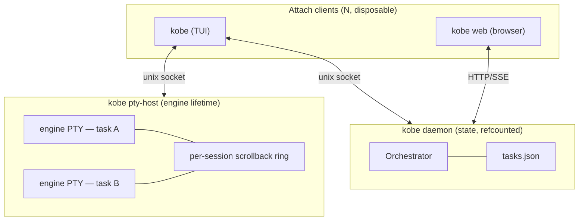

# Sessions: what survives what

Short answer: **quitting kobe stops nothing.** Only a reboot or an explicit
`kobe reset` ends your running sessions.

## What survives

| If you… | Engine keeps running | Scrollback | Tasks + worktrees | Conversation |
|---|---|---|---|---|
| Quit the TUI | ✓ | ✓ | ✓ | ✓ |
| Drop your SSH connection | ✓ | ✓ | ✓ | ✓ |
| `kobe daemon restart` | ✓ | ✓ | ✓ | ✓ |
| Reboot, or `kobe reset` | — | — | ✓ | ✓ resumable |

The first three rows are the whole point: the TUI is a viewport, and the
daemon is replaceable. The last row is the hard boundary — nothing keeps
processes alive across a reboot, and raw terminal output is never written to
disk. Your *conversations* still come back, because the engine wrote them.

## Why: three processes, three lifetimes

- **TUI and web** are pure attach clients. Closing one touches nothing else.
- **The daemon** owns your task index, worktree records, and the event bus.
  It starts on first launch and stops after the last attached GUI disconnects,
  unless an enabled routine holds it alive. Restarting it is routine:
  `kobe daemon restart`.
- **The PTY host** owns every engine and shell process, plus their
  scrollback. It's deliberately a *separate* process from the daemon, so a
  daemon restart never kills a running engine. Like the tmux server, it exits
  on its own only after sitting at zero live sessions. `kobe reset` is the
  explicit teardown.

## Detaching and reattaching

There's no detach command — quitting **is** detaching. `ctrl+q`, closing the
terminal, an SSH drop: the connection closes and the engine keeps running.

Reattaching is just running `kobe` again. A fresh TUI finds the background
sessions and reopens them. The existing session always wins, so reattaching
never restarts anything.

You can attach from several clients at once. Terminal output goes to every
client watching that session; your cursor, focus, and unsent draft stay
local to each one.

**Two exceptions to "everything survives a quit":**

- Archiving a task stops its sessions. A janitor sweeps sessions whose task
  is no longer live, so a headless `kobe api archive` can't leak an engine
  that runs forever.
- An engine that exits on its own is kept as a dead session with its
  scrollback intact, so you can still see *how* it died.

## Scrollback

Two buffers, both bounded:

- **What a reattach replays** — the PTY host keeps ~512 KiB of recent output
  per session, in memory only. When the host ends (reboot, `kobe reset`), it's
  gone.
- **How far you can scroll** — `terminal.scrollbackRows` in Settings →
  General → Terminal, default 1000 rows. Applies to terminals started after
  the change.

Reattach has a fast path: if a tab was only hidden, kobe replays just the
bytes written since it was parked, so waking it is bit-identical to never
having left. Attaching from a different-sized terminal resizes the session —
last attach wins, like tmux.

## Resuming a conversation

Process survival and conversation survival are different things. The
conversation is the engine's own file on disk, so it outlives every kobe
process, including a reboot.

- Claude tabs pin their conversation up front, so a tab that already ran
  comes back into the same conversation after a reboot rather than a blank
  one. Engines that can't take a caller-set session id (Codex and the rest)
  relaunch fresh.
- A tab found dead on attach gets **one** automatic resume attempt. If that
  dies too, the tab closes rather than respawning forever.
- `ctrl+a` `y` opens the resume picker for the active task — kobe's mirror of
  claude-code's `/resume`. It lists every session in the task's worktree.

## kobe web as a second client

`kobe web` is a second live client of the same daemon: same tasks, same
issues, same event stream. An open browser tab keeps the daemon alive exactly
like an attached TUI does.

One difference: the web dashboard's terminals are **not** views of the TUI's
sessions. They're spawned by a separate sidecar process with their own
lifetime. They survive page reloads and reconnects, and several browser views
of one tab share a single terminal — but they're independent of the sessions
your TUI is attached to.

## Not supported

Stated plainly so this page doesn't overpromise:

- **Surviving a reboot with processes intact.** Tasks, worktrees, and
  conversations come back from disk; running processes and scrollback don't.
- **Attaching from another machine.** The sockets are local only. Running the
  TUI over SSH works because both ends are on the same host; there's no
  native remote attach.
- **Event replay on reattach.** Reattaching resyncs from a snapshot, not by
  replaying events you missed.
- **Unsent drafts.** A typed-but-unsent message is local to that client and
  lost if it dies.
