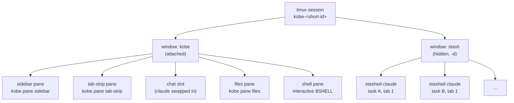
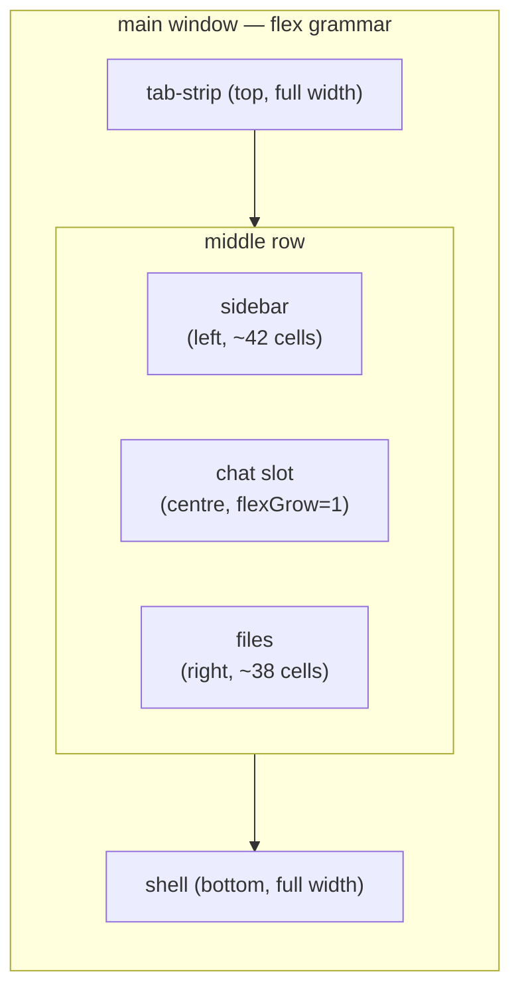
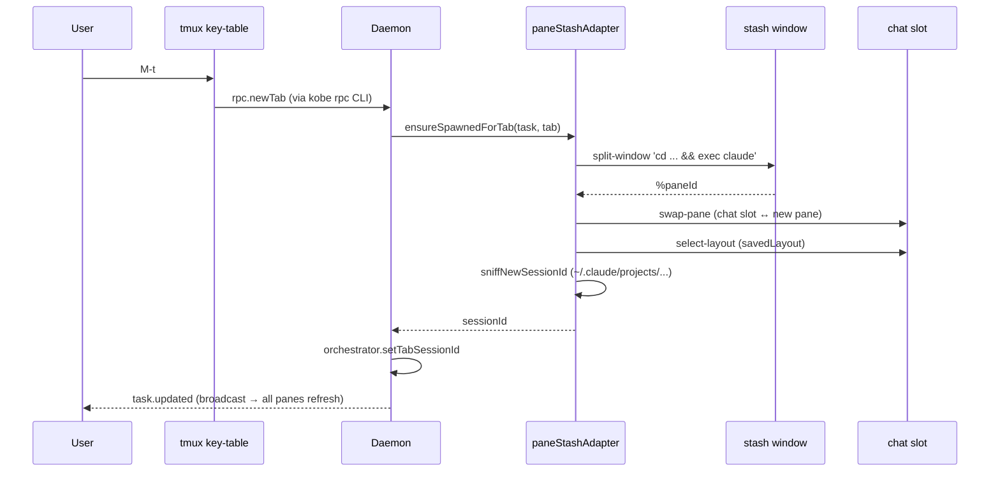

# kobe — Architecture diagrams

Renderable copies of the four diagrams from
[`ARCHITECTURE.md`](./ARCHITECTURE.md) §3. Same content, isolated so
you can paste any single diagram into a deck, design doc, or PR
description without the prose around it. Edit both files together
when the shape changes — there is no auto-sync.

All diagrams render natively in GitHub markdown, GitHub PR previews,
and VS Code's built-in markdown preview (CLAUDE.md "Diagrams in
`docs/`: use Mermaid" rule).

---

## 1. tmux session tree

What the user sees when they `tmux list-windows -t kobe-<id>`. The
main window is what they attach to; the stash window is hidden
(`new-window -d`) and holds claude panes that aren't currently
displayed. The daemon's pane-stash adapter (`src/daemon/pane-stash-adapter.ts`)
swaps panes between the stash window and the chat slot in the main
window via `swap-pane`.



---

## 2. 5-pane main-window layout

Top row carries the tab-strip across the whole window; bottom row
carries an interactive shell. Sidebar, chat, and files take the
middle row, with the chat slot owning the centre `flexGrow={1}`
share. Sidebar / files / shell stay put for the lifetime of the
session — only the chat slot swaps content.



---

## 3. Communication architecture

Every pane subprocess is a thin daemon client. The daemon is the
single owner of orchestrator state — task list, active task, chat
tabs, engine handles, pane-stash bookkeeping. Pane subprocesses
seed via `hello`, react to broadcast events, and dispatch user
intent through `rpc.*` request frames. Engine traffic (`claude` /
`codex` subprocesses) flows through the same daemon, not through the
pane subprocesses directly — the chat slot's claude pane is just
another tmux pane the daemon spawned and now talks to via the
filesystem (JSONL transcripts under `~/.claude/projects/`).

```mermaid
sequenceDiagram
  participant TUI as tmux client (user)
  participant Pane as kobe pane &lt;name&gt;
  participant Daemon as kobe daemon
  participant Orch as Orchestrator
  participant Engine as claude / codex
  Pane->>Daemon: connect (unix socket)
  Pane->>Daemon: hello
  Daemon-->>Pane: tasks + activeTaskId
  TUI->>Daemon: rpc.newTab (via tmux bind-key)
  Daemon->>Orch: createTab
  Orch->>Engine: spawn (cwd, prompt)
  Engine-->>Orch: stream-json events
  Orch-->>Daemon: task.updated
  Daemon-->>Pane: task.updated (broadcast)
  Pane->>Pane: signal update → Solid re-render
```

---

## 4. Pane-swap flow (rpc.newTab)

The shape of every active-state mutation: an `rpc.*` request hits
the daemon, the orchestrator allocates the engine session, the
pane-stash adapter spawns a new claude pane in the stash window,
swaps it into the chat slot, restores the saved window layout, and
sniffs the new claude session id from `~/.claude/projects/`. The
saved-layout restore is load-bearing because `swap-pane` can drift
sibling sizes when the source and target panes have different
parents. The session-id sniff is what closes the loop: the daemon
persists the sniffed id on the tab so a subsequent `rpc.switchTask`
can `--resume` the same session.


