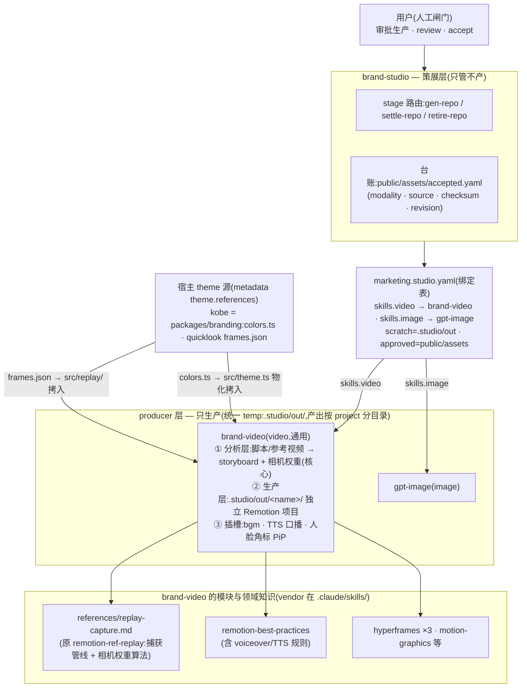
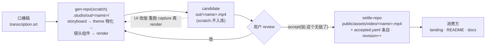

# brand-studio × brand-video — 架构与生产生命周期

brand-studio 是**策展层**(curate/settle,永不生产),在上层管理所有 producer:brand-video
(`skills.video`)、gpt-image(`skills.image`)是它在 `marketing.studio.yaml` 里绑定的生产端
(只生产,不落账)。

**brand-video 是唯一的 video producer,且是通用 skill**(不 for 单一产品;宿主上下文全部由
metadata 注入)。原 remotion-ref-replay 已并入它:参考视频/脚本的**分析层(storyboard +
相机权重分配)是这个 skill 的核心资产**,捕获方法收在其 `references/replay-capture.md`;
旧名保留为兼容别名,只迭代这一个 skill。能力插槽(bgm / TTS 口播 / 人脸角标 PiP)挂在
同一时间轴上,不另立 skill。

目录契约:**所有 producer 的产出先进同一个 temp `.studio/out/`**(gitignored scratch);其中
brand-video 的产出**按 project 分目录**——每支片子/每类适配一个独立 Remotion 项目
(`.studio/out/kobe-intro/` 这类)。用户 accept 后才 settle 进 `public/assets/` 并记入 `accepted.yaml`。

仓库分发:brand-studio 本体是独立 GitHub 仓库,以 submodule 挂在 `.agents/skills/brand-studio`;
producer skill 也可以各开独立仓库、按同样方式挂载——**不变量是 `git clone --recursive` 一次拉全**。

## 架构:谁管谁

## 生命周期:一支片子怎么走

要点:

- **边界**(brand-studio 的 CLAUDE.md):studio 只做确定性的策展动作(路径解析、验证、settle、
  台账、checksum);生产全部在 producer;重工具链 producer(Remotion)不 vendor 进 studio
  payload,走 metadata 绑定——这就是 brand-video 作为"subskill"的形态。
- **一致性由构造保证**:镜头组件只准 `import { colors } from "./theme"`,不准字面 hex;
  theme 是 scaffold 时从 `packages/branding/src/colors.ts` 物化拷入的。
- **scratch 永不自动入库**:没 accept 的产物留在 `.studio/`(gitignored);accept 语义参照
  studio 规则(单候选语境下"这个可以/无敌了"即 accept)。
- worked example:`.studio/out/kobe-intro/`(本机 scratch)→ `public/assets/video/kobe-intro.mp4`
  (已 settle,台账见 `public/assets/accepted.yaml`)。
