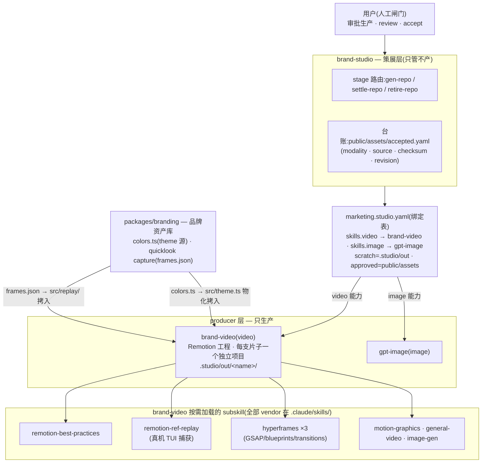
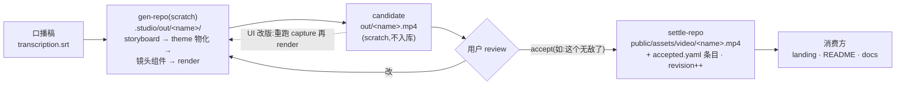

# brand-studio × brand-video — 架构与生产生命周期

brand-studio 是**策展层**(curate/settle,永不生产);brand-video 是它在 `marketing.studio.yaml`
里 `skills.video` 绑定的 **video producer**(只生产,不落账)。目录契约:生产在 `.studio/out/`
(gitignored scratch),用户 accept 后 settle 进 `public/assets/` 并记入 `accepted.yaml`。

## 架构:谁管谁

## 生命周期:一支片子怎么走

要点:

- **边界**(brand-studio 的 CLAUDE.md):studio 只做确定性的策展动作(路径解析、验证、settle、
  台账、checksum);生产全部在 producer;重工具链 producer(Remotion)不 vendor 进 studio
  payload,走 metadata 绑定——这就是 brand-video 作为"subskill"的形态。
- **一致性由构造保证**:镜头组件只准 `import { colors } from "./theme"`,不准字面 hex;
  theme 是 scaffold 时从 `packages/branding/src/colors.ts` 物化拷入的。
- **scratch 永不自动入库**:没 accept 的产物留在 `.studio/`(gitignored);accept 语义参照
  studio 规则(单候选语境下"这个可以/无敌了"即 accept)。
- worked example:`.studio/out/kobe-intro/`(本机 scratch)→ `public/assets/video/kobe-intro.mp4`
  (已 settle,台账见 `public/assets/accepted.yaml`)。
