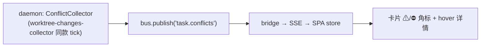

# 冲突雷达(Conflict Radar)— 设计报告

> 提案:看板卡片上提前标出"这张卡和哪张卡会撞车"。kobe 的每张 in-flight 卡
> 都是一条真分支 + 一个真 worktree——这是其他看板结构上没有的数据,也是
> 并行跑 N 个 agent 改同一个 repo 时最疼的盲区:两个 agent 各自干得很好,
> 合并时才发现改了同一段代码。雷达把这个发现时刻从"合并时"提前到"进行中"。
> 状态:提案,未实现。配套:[`web-kanban.md`](./web-kanban.md)。

## 1. 信号分级:两级漏斗

全量两两做真合并太贵,分两级,L1 出资格、L2 出判决:

| 级别 | 信号 | 算法 | 成本 | 含义 |
|---|---|---|---|---|
| **L1 文件重叠** | ⚠ 黄 | 每卡算 `touchedFiles`(对 merge-base 的 `git diff --name-only` ∪ 未提交脏文件),两两求交集 | 每卡一次 diff,交集纯内存 | "改了同样的文件"——可能冲突 |
| **L2 真冲突** | ⛔ 红 | 仅对 L1 命中的卡对跑 `git merge-tree --write-tree A B`(git ≥ 2.38,干跑合并,**不碰任何 worktree**),解析输出里的 conflict 段 | 每对一次 merge-tree | "合并必然产生冲突标记" |

git < 2.38 没有 `merge-tree --write-tree`:退化为只有 L1(黄标),启动时探测一次版本。

## 2. 数据流



- **采集端**:daemon 新增一个 collector,复用 `worktree-changes-collector` 的
  节奏与生命周期(暂停/恢复随 gui 数);每 tick:
  1. 对每张非 main、非 archived、非 remote 的卡取 `(head, dirtyHash)`;
  2. 两者都没变的卡跳过(增量);
  3. 变了的卡重算 `touchedFiles`,再仅与"自己变了 ∪ 对方变了"的卡对重算交集;
  4. L1 命中且 `(headA, headB)` 缓存未命中 → 跑一次 merge-tree。
- **协议**:新频道 `task.conflicts`,广播全量(数据量小):

  ```ts
  { pairs: Array<{ a: TaskId; b: TaskId; files: string[]; level: "overlap" | "conflict" }> }
  ```

  照例三表同步:协议 `ChannelPayloads` + `SPA_CHANNELS` + store reducer,
  契约测试自动拦漏。
- **UI**:卡片右上角 ⚠N / ⛔N(N = 对端卡数);hover 列出"与『xxx』重叠:
  `src/auth.ts` +2 个文件";点击高亮对端卡(同列滚动到可见)。

## 3. 关键设计决定

- **未提交改动只进 L1,不进 L2。** merge-tree 只认提交;脏文件用
  `--name-only` 交集近似足够(脏=正在动,本来就该黄标提醒)。给脏文件做
  虚拟提交再 merge-tree 技术上可行但复杂度不成比例,v1 明确不做。
- **比较基线 = 两卡分支对 repo 默认分支的 merge-base**,不做三方比较;
  卡对之间直接 merge-tree(A 的 head × B 的 head)。
- **复杂度**:N 张活跃卡 → C(N,2) 对。N≤20(本地单机的现实上限)完全无压力;
  增量 + 缓存后稳态 tick 接近零开销。超过 50 张卡时跳过 L2 只保 L1(log 提示,
  no silent caps)。
- **排除项**:main 任务(没有自己的分支)、remote 任务(git 在远端)、archived。
- **不做自动动作**:雷达只展示,不阻止拖拽、不自动挪卡——它是信息,不是守门。
  (未来 merge-train 落地时,红标卡对可以驱动"先合谁"的排序建议。)

## 4. 与现有件的衔接

| 现有件 | 复用方式 |
|---|---|
| `worktree-changes-collector` | collector 骨架、tick/暂停语义、git 调用纪律 |
| `task.snapshot` / SSE 管道 | 新频道照搬广播路径 |
| 看板乐观层 | 不相干——雷达数据只读,无 override 交互 |
| `/pty/send` 快捷指令 | 后续可加"让两边 agent 互相通气"按钮:把冲突文件清单发进两个会话 |

## 5. 里程碑

| 步 | 内容 | 量 |
|---|---|---|
| R0 | 命令行 POC:对沙箱两张卡手跑 merge-tree,验证输出解析 | 半天 |
| R1 | daemon collector + `task.conflicts` 频道 + L1(黄标) | 1 天 |
| R2 | L2 merge-tree(红标)+ 缓存 + git 版本探测回退 | 1 天 |
| R3 | 卡片角标 + hover 详情 + 对端高亮 | 半天 |

## 6. 标记之后:动作链(雷达的"然后呢")

信号本身只是焦虑;雷达的价值兑现靠的是 kobe 的独有条件——**标记的双方都是
活会话,每个标记都能变成一条发给当事 agent 的指令**(`/pty/send` 管道现成)。
按落地顺序:

1. **互相通气(v1 就该带上)** — 冲突徽标的 hover 详情里加一个"notify both"
   按钮:把对方的卡名 + 重叠文件清单各发进两个会话——"任务『X』也在改
   `src/auth.ts`,协调你的改动:缩小触碰面 / 等它先合 / 把共用部分提出来"。
   两个 agent 在各自上下文里主动避让。其他看板的冲突信号最多 @ 一个人;
   我们的信号直接驱动当事进程。
2. **rebase 指令一键发** — A 卡合进 main 后,对红标的 B 卡一键发:"main 已
   更新(含『X』对 auth 的改动),rebase 并解决冲突"。冲突解决是合并时刻
   最痛的人工活,而 B 的 agent 是最懂"B 为什么这么改"的一方——让它自己解,
   解完照常走 review → done。
3. **merge train 排序依据** — done 列的合并队列(见 web-kanban.md 后续提案)
   用雷达数据排序:无标记的先走;红标对里先合改动小的一方,随后自动对另一方
   触发动作 2。
4. **开工避让** — backlog 卡与 in-flight 卡黄标时,auto-start 可以(opt-in)
   延迟放行:"等『X』合完再开工",从源头避免撞车。
5. **对照视图** — 点冲突对在板内并排开两个 diff/peek,人肉裁决两边谁让谁。

v1 范围仍然只做"展示 + 动作 1";2-4 依次叠加,全部复用既有管道
(`/pty/send`、merge-train、auto-start 守门)。

## 7. 风险

- **git 版本**(merge-tree --write-tree 需 ≥2.38,2022-10 发布):探测 + L1 回退,不算硬伤。
- **奇异分支**(adopt 进来的无共同祖先分支):merge-base 失败 → 该卡只参与 L1。
- **大 repo 首次全量**:N 次 `diff --name-only` 串行打散到多个 tick,避免尖峰。
- **误报观感**:文件重叠 ≠ 一定冲突(黄标本质是召回优先)。色阶分明(黄=可能,红=必然)+ hover 里写清楚语义,避免狼来了。
