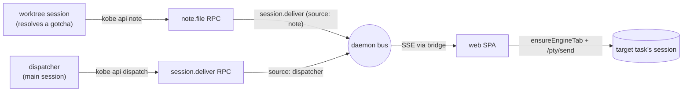

# Field-notes dispatcher (v1)

Status: shipped behind `experimental.dispatcher` (Settings → Dev). Off by default.

## What it is

kobe runs many agent sessions on one repo in parallel, and each one rediscovers the same gotchas (the build flag, the flaky test, the API trap) from scratch. The dispatcher closes that loop: **a worktree session that resolves a non-obvious, repo-level gotcha files a one-line field note; the repo's main session — the dispatcher — receives it and relays it to the in-flight tasks that would benefit.** Knowledge gets paid for once.

Design decisions (2026-06-13):

- **The dispatcher does NOTHING about merge conflicts.** A true conflict only matters at integration time, the colliding branch might be a throwaway, and early forced merges pollute branches with content that may never land — resolution timing belongs to humans and the tasks themselves, not to the dispatcher.
- **Dispatcher = the repo's `kind: "main"` task.** No new task kind, no designation state. On the web board it surfaces only when the board is scoped to a single project (chip opens the peek drawer).
- **Full autonomy, no approval gate** — bounded by effectors instead: the dispatcher can *read* (`kobe api collect`) and *message sessions* (`kobe api dispatch`); it has no verb that mutates tasks, statuses, or worktrees. Worst case is a stray FYI.
- **Rules where unambiguous, agent where ambiguous.** Addressing (author → that repo's main task) is daemon code; *who benefits from a note* is the dispatcher agent's judgment.

## The pieces

| Piece | Where | Job |
|---|---|---|
| `kobe api note --task-id <id> --text <line>` | `kobe/src/cli/api-cmd.ts` | A session files a discovery. |
| `note.file` RPC | `kobe-daemon/src/daemon/handlers.ts` | Addressing only: find the author's repo's main task, forward over `session.deliver` with provenance (`[KOBE FIELD NOTE] from "<author>" (task <id>): …`). Accepted-but-unrouted when the repo has no main task or the author *is* the dispatcher. |
| `session.deliver` channel | `kobe-daemon/src/daemon/protocol.ts` | "Paste this text into task X" — an address, not a delivery. EVENT semantics; consumers dedupe on `at`. |
| `kobe api dispatch --task-id <id> --prompt <text>` | api-cmd + `session.deliver` RPC | The dispatcher's relay. Daemon-routed on purpose: `kobe api send` pastes via tmux and would spawn a duplicate engine for web-PTY-hosted sessions. |
| `noteFilingProtocol` + `worktreeProtocol` | `kobe/src/engine/interactive-command.ts` | Worktree (card) sessions get ONE composed `--append-system-prompt`: status self-report (gated by `experimental.autoStatus`) + note filing (gated by `experimental.dispatcher`). |
| `dispatcherProtocol` | same | The main session's role prompt: relay verbatim with provenance, only to tasks whose work plausibly touches the same area, never back to the author, never twice, no conflict actions, no git outside its own cwd. |
| Protocol CLI invocation | `kobeApiInvocation()` | Commands in protocols bake the environment-correct invocation (packaged → `kobe api`; source checkout → the dev bun line), so a dev sandbox agent never drives a stale global install (BAD_VERB field bug). |
| SPA forwarder | `kobe-web/src/lib/dispatch-delivery.ts` | The front-end half of delivery (browser owns tab ids). `at` high-water mark in localStorage; failed sends roll back so the snapshot replay retries. |
| Board chip | `kobe-web/src/components/Board.tsx` | `dispatcher` chip on repo-scoped boards; opens the main session in the peek drawer. |

## Known v1 limits

- **Delivery requires an open dashboard** (the SPA is the forwarder). The bridge snapshot replays the most recent missed event on the next visit; an event-channel replay is last-one-only.
- **Claude-only injection**, same as the status protocol.
- **No persistence/board rail for notes yet** — the dispatcher's transcript is the log. A "Field Notes" board rail + new-task bundling is the natural v2.
- **Trust is deliberately deferred**: agent-authored text flows into other agents' inputs with no human gate (relays carry provenance prefixes). Revisit before any default-on.
