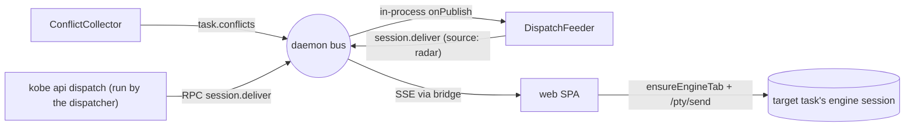

# Conflict dispatcher (v1)

Status: shipped behind `experimental.dispatcher` (Settings → Dev). Builds on the conflict radar ([conflict-radar.md](./conflict-radar.md)).

## What it is

Each repo's **main session** (the `kind: "main"` task — repo root, no board card) doubles as that repo's **dispatcher**: an autonomous agent that receives conflict-radar digests and coordinates the worktree task sessions by messaging them. The dispatcher exists only per repo — on the web board it surfaces only when the board is scoped to a single project (a selected project chip, or a one-project board).

V1 design decisions (2026-06-13, by request):

- **Full autonomy, no approval gate.** The dispatcher acts without asking. Its blast radius is bounded by its effectors instead: it can *read* (`kobe api collect`) and *message sessions* (`kobe api dispatch`) — it has no verb that mutates tasks, statuses, or worktrees.
- **Radar only.** The only feed is `task.conflicts`. Field notes / dependency feeds are future extensions of the same channel.
- **Rules where unambiguous, agent where ambiguous.** Deterministic plumbing (regroup, change-guard, addressing) is daemon code; only the judgment calls (who to notify, what to suggest) reach the LLM.

## The pieces

| Piece | Where | Job |
|---|---|---|
| `session.deliver` channel | `kobe-daemon/src/daemon/protocol.ts` | "Paste this text into task X" — an address, not a delivery. EVENT semantics: consumers dedupe on `at`. |
| `DispatchFeeder` | `kobe-daemon/src/daemon/dispatch-feeder.ts` | In-process bus subscriber on `task.conflicts`: regroup pairs per repo → digest text → `session.deliver` to that repo's main task. Publish-on-change per repo; one all-clear when a repo's pairs vanish. |
| `session.deliver` RPC | `kobe-daemon/src/daemon/handlers.ts` | The dispatcher's messenger backend (`kobe api dispatch --task-id <id> --prompt <text>`). Validates the task, stamps `at`, publishes. |
| `dispatcherProtocol` | `kobe/src/engine/interactive-command.ts` | The system prompt injected into a main session's claude launch (`--append-system-prompt`), the exact complement of the status protocol's main-task exclusion. Applied in both spawn paths: tmux (`tui/panes/terminal/tmux.ts`) and web (`kobe-web/server/session.ts`). |
| SPA forwarder | `kobe-web/src/lib/dispatch-delivery.ts` | The front-end half of delivery. Tab ids are browser-generated, so only the SPA can route into web-hosted sessions without spawning duplicates. Dedupe by `at` via a localStorage high-water mark; failed sends roll back the mark so the reconnect replay retries. |
| Board chip | `kobe-web/src/components/Board.tsx` | `dispatcher` chip in the board header, repo-scoped boards only — activity dot + opens the main session's workspace. |

## Why delivery is front-end-side

`kobe api send` pastes via tmux and **spawns the tmux session if absent** — correct in the TUI world, but a task whose engine lives in the web PTY sidecar would get a duplicate tmux twin. The daemon deliberately never touches sessions (its tmux-freedom is load-bearing, see CLAUDE.md), so `session.deliver` ships the address over the bus and whichever front-end *hosts* the session pastes it. Today that's the web SPA; a TUI-side subscriber can adopt the same channel later.

## Known v1 limits

- **Delivery requires an open dashboard.** The SPA is the forwarder, so radar feeds land only while a browser tab (any page, not just /board) is connected; the bridge snapshot replays the most recent missed event on the next visit.
- **Event-channel replay is last-one-only.** Two deliveries racing on different tasks: a late subscriber replays just the newest. The radar feeder self-heals (it republishes on the next change); a missed `kobe api dispatch` message does not.
- **Claude-only injection**, same as the status protocol — codex has no `--append-system-prompt` equivalent yet.
- **Multi-browser dedupe is best-effort** (localStorage check-and-set; a lost race duplicates a paste, never loses one).
- **Trust is deliberately deferred**: agent-authored text flows into other agents' inputs with no human gate. The audit surface is the dispatcher session's own transcript. Revisit before any default-on.
