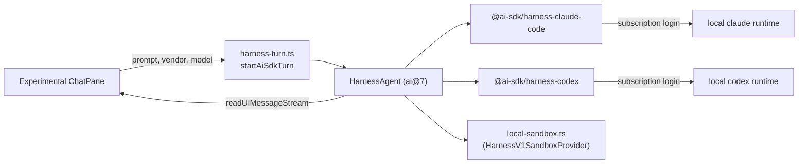

# Provider Runtime — the AI SDK harness behind the native chat pane

> **Superseded (2026-07-06).** The native chat pane / AI SDK harness path
> this doc describes was deleted whole in the 2026-07-06 provider-runtime →
> terminal pivot: kobe now embeds the real `claude`/`codex` CLI in an
> in-process embedded terminal tab instead of driving a harness. The
> `src/engine/ai-sdk/` directory referenced below no longer exists and
> `package.json` carries no `@ai-sdk/*` dependency. This doc is kept for
> historical rationale only — see git history for the deleted code, and
> `docs/DESIGN.md` §2.2 / current architecture notes for the live shape.
>
> Everything below this line describes the deleted path in present tense —
> read it as history, not as current implementation.
>
> Decision doc. Why the experimental native chat pane ran on
> the Vercel AI SDK's harness packages, what the boundaries were, and what was
> deliberately NOT built.
>
> Companions: [`../DESIGN.md`](../DESIGN.md) §2.2 (the superseded
> "no `@ai-sdk/*`" lock) and the engine contract in
> [`packages/kobe/src/engine/registry.ts`](../../packages/kobe/src/engine/registry.ts)
> (still live). The `src/engine/ai-sdk/harness-turn.ts` runtime this doc
> originally linked no longer exists.

---

## 1. Problem

The product path at the time ran one always-on interactive engine CLI per task
inside tmux. That was the right default — the engine owns auth, approvals, and
rendering — but its render loop burns CPU while *idle*, and with many parallel
tasks the laptop cooks. The native workspace needs a chat backend that spends
CPU only while a turn is actually running.

## 2. Decision history

| Date | Decision |
|------|----------|
| 2026-06 | DESIGN.md §2.2 locks "no vendor-neutral LLM abstraction, no `@ai-sdk/*` adapters" — correct for the tmux path, written before a native pane existed. |
| 2026-07-03 | First native-chat spike: headless `claude -p --output-format stream-json` with hand-rolled wire types + stream parsing. Worked, but meant kobe owning a vendor schema. |
| 2026-07-04 | pi RPC wrapper spike **rejected** (reset). Direction fixed: `ai@7` `HarnessAgent` + `@ai-sdk/harness-claude-code` / `harness-codex`, `UIMessage` rendered natively. |
| 2026-07-05 | Headless backend retired; the AI SDK harness is the **sole** native-chat backend. DESIGN.md lock updated to name this exception. |

## 3. Shape

- **One turn per prompt.** `startAiSdkTurn` streams growing `UIMessage`
  snapshots; the pane replaces its tail transcript item per update. No engine
  process idles between prompts — that is this backend's reason to exist.
- **`UIMessage` is the render schema.** The transcript holds harness
  `UIMessage`s verbatim and `ChatRow` renders their parts directly with the
  SDK's own guards (`isToolUIPart` etc.). Vercel maintains the schema; kobe
  builds **no mapping layer** on top of it.
- **Engines stay products.** Auth is the engine's subscription login — no API
  keys, no raw model calls. The harness drives the same locally-installed
  runtimes the tmux path uses.
- **The runtime is cached per `(vendor, worktree)`** and rebuilt when the
  requested model/effort changes; turns are sequential per worktree.
- **`local-sandbox.ts` is ours on purpose:** `@ai-sdk/harness` exports only
  the sandbox *interface*, no local implementation (lifted from mc-launcher,
  with attribution).

## 4. Boundaries (what keeps this from becoming an abstraction layer)

1. **Engine-owned wiring only.** The pane learns everything from the engine
   registry's `nativeChat` descriptor (`harnessVendor`, `builtinSlashes`,
   `userSlashes`) plus `EngineCapabilities`/`EngineIdentity`. A new engine =
   one registry entry; neutral TUI code never compares vendor-id strings.
2. **No kobe-side message types.** Anything that needs a message shape uses
   the SDK's `UIMessage`/`UIMessagePart` types and helpers directly. If a
   mapping layer ever seems necessary, that is a signal to push on the SDK,
   not to fork the schema.
3. **The tmux path is untouched.** The then-default product path (interactive
   CLIs in tmux) did not import any `@ai-sdk/*` package and kept DESIGN.md
   §2.2's original stance.

## 5. Open gaps (tracked, not blocking)

- **Persistence**: the pane keeps no on-disk history; a remounted pane starts
  a fresh harness session. Plan: a one-way conversion from `UIMessage` history
  to the local claude session-record format at the persistence boundary —
  never a live mapping layer.
- **Permission mode**: surfaced + cycled in the composer but not forwarded —
  the harness exposes no per-turn permission surface yet.
- **Usage/stats**: token/context/speed telemetry not wired from harness
  responses into the engine-normalized telemetry surface.
- **Session continuity**: resuming an existing claude session id through the
  harness.
