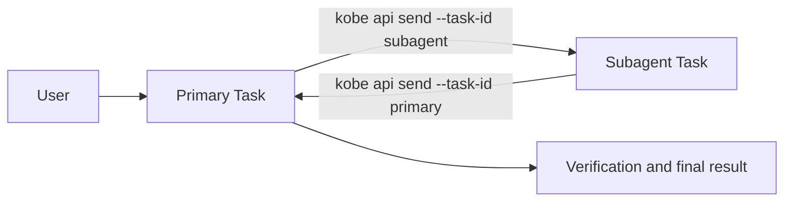

# Directed Task delegation

## Problem

Copying Task ids by hand makes cross-repo delegation possible but awkward.
Treating the two Tasks as equal Channel endpoints is the wrong ownership
model: one Task owns the user's goal and the other is a bounded subagent.

## Topology



The subagent Task stores one `delegation` record containing its direct
`primaryTaskId`, protocol version, and link time. A primary can therefore own
many subagents; one subagent has at most one direct primary. Kobe rejects
self-links and cycles. Re-selecting a different primary explicitly re-parents
the subagent.

This record is topology only. Messages stay in provider-native sessions and
work remains isolated in each Task's own worktree.

## Establishing a link

1. From a focused engine Task, `prefix+@` opens the Task picker.
2. Selecting a Task persists `selected.delegation.primaryTaskId = focused.id`.
3. Kobe injects a self-contained bootstrap turn into the primary Task.
4. The primary sends a bounded request to the literal subagent id when useful.
5. The request carries the literal primary id, so the subagent can reply once
   without discovering global UI state.

Neither side is forked. There is no Channel page, shared composer, relay
process, or Kobe-owned transcript.

## Delegation protocol v2

The runtime contract has one source of truth:

```bash
kobe api delegation-protocol \
  --primary-task-id <primary-id> \
  --subagent-task-id <subagent-id> --pretty
```

The command is offline and returns the exact v2 enum values, defaults,
semantics, a fresh request id, and matching request/result templates. Its
implementation is
`packages/kobe/src/core/task-delegation-protocol.ts`. The UI bootstrap and Kobe
skill point agents to this command instead of maintaining independent schema
copies; this document explains ownership and flow only.

The default exchange is deliberately two semantic messages:

```text
hop 1: primary request, one reply required
hop 2: subagent result, no reply
```

Every message in one request chain carries the same request id. `hop` advances
once per semantic message and must not exceed `max_hops`; a larger budget is an
explicit Primary decision for work that genuinely needs progress or blocked
rounds. Transport success is not an agent acknowledgement, so agents never
spend a turn replying only “received”.

The request template carries a shell-safe `contract_command` with the same
request id and hop budget. The subagent runs that literal command to recover
the matching result template; it does not invent fields or accidentally start
a second request chain. Each template's `target_task_id` is the delivery
destination for `kobe api send`.

The stable behavioral boundaries remain:

- a send is a complete engine turn, not a packet in an open chat stream;
- explicit ids are mandatory because the active Task can change;
- recursive delegation is forbidden unless the user asks;
- worktree and repository ownership remain isolated;
- destructive, git publication, and merge authority are never inherited;
- the primary verifies the subagent's evidence and owns the final result.

There is deliberately no global sequence number, acknowledgement, retry queue,
or delivery log in v2. Hosted prompt delivery already reports failure, while
an agent-level transport would duplicate engine session ownership before a
real ordering or reliability requirement exists.
