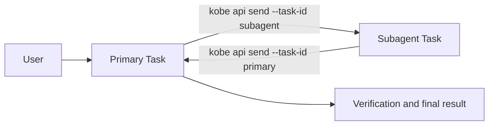

# Directed Task delegation

## Problem

Copying Task ids by hand makes cross-repo delegation possible but awkward.
Treating the two Tasks as equal Channel endpoints is the wrong ownership
model: one Task owns the user's goal and the other is a bounded subagent.

## Topology



The subagent Task stores one `delegation` record containing its direct
`primaryTaskId`, protocol version, and link time. A primary can therefore own
many subagents; one subagent has at most one direct primary. Kobe rejects
self-links and cycles. Re-selecting a different primary explicitly re-parents
the subagent.

This record is topology only. Messages stay in provider-native sessions and
work remains isolated in each Task's own worktree.

## Establishing a link

1. From a focused engine Task, `prefix+@` opens the Task picker.
2. Selecting a Task persists `selected.delegation.primaryTaskId = focused.id`.
3. Kobe injects a self-contained bootstrap turn into the primary Task.
4. The primary sends a bounded request to the literal subagent id when useful.
5. The request carries the literal primary id, so the subagent can reply once
   without discovering global UI state.

Neither side is forked. There is no Channel page, shared composer, relay
process, or Kobe-owned transcript.

## Delegation protocol v1

Each request starts with:

```text
[KOBE DELEGATION REQUEST v1]
primary_task_id: <id>
subagent_task_id: <id>
objective: <one bounded outcome>
constraints: <scope, files, permissions, forbidden actions>
done_when: <observable acceptance evidence>
reply_via: kobe api send --task-id <primary-id> --prompt "<structured result>"
```

The skill carries the normative rules:

- a send is a complete engine turn, not a packet in an open chat stream;
- explicit ids are mandatory because the active Task can change;
- recursive delegation is forbidden unless the user asks;
- worktree and repository ownership remain isolated;
- destructive, git publication, and merge authority are never inherited;
- the primary verifies the subagent's evidence and owns the final result.

There is deliberately no sequence number, acknowledgement, retry queue, or
delivery log in v1. Hosted prompt delivery already reports failure, while an
agent-level transport would duplicate engine session ownership before a real
ordering or reliability requirement exists.
