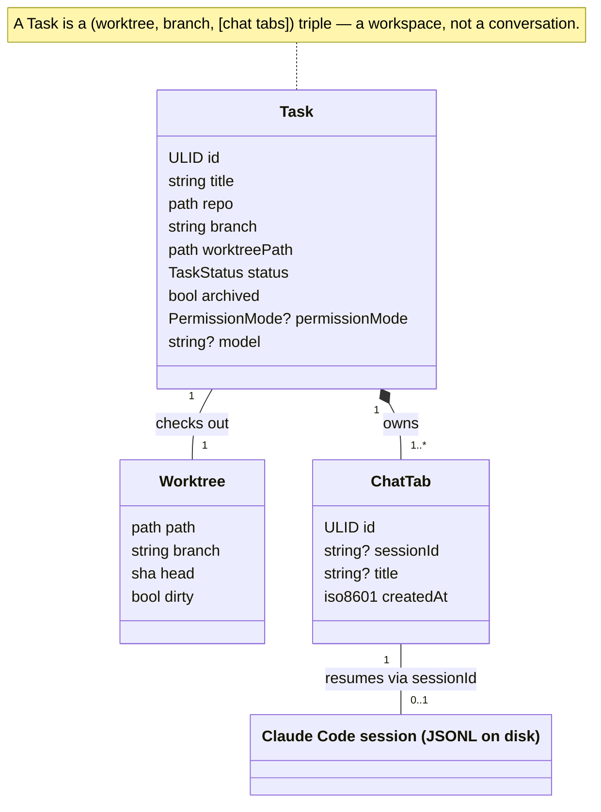
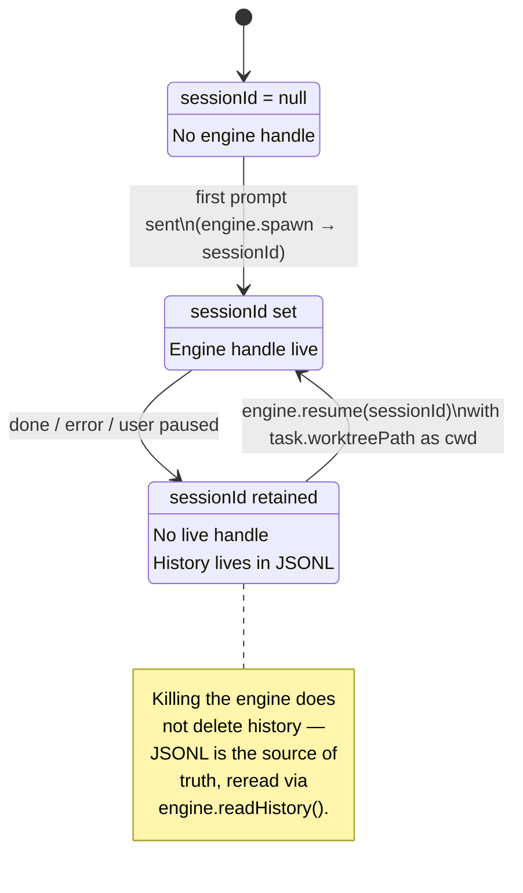

# Tasks, Worktrees, and Chat Tabs

> Concept doc. The shapes here are the source of truth for how the
> orchestrator, the sidebar, and the chat pane talk about "what is the
> user working on right now."
>
> Companions: [`../DESIGN.md`](../DESIGN.md) §2.4 + §10 (data model); worktree
> path resolution is §2 below (there is no separate DESIGN.md subsection for
> it). On-disk types: [`packages/kobe/src/types/task.ts`](../../packages/kobe/src/types/task.ts).

---

## 1. Three nouns

kobe has exactly three nouns in the orchestration layer. Get these
straight and the rest of the codebase reads itself.

| Noun         | What it is                                                                 | Cardinality        |
|--------------|----------------------------------------------------------------------------|--------------------|
| **Task**     | One unit of work the user is tracking. Lives in `~/.kobe/tasks.json`.      | N per repo         |
| **Worktree** | One git worktree on disk, checked out to one branch.                       | **1 per Task**     |
| **ChatTab**  | One Claude Code session, with its own conversation transcript.             | **N per Task**     |

The 1↔1↔N relationship is the whole point:

A Task is a **(worktree, branch, [chat tabs])** triple. It is not "a
chat" and it is not "a branch" — it is a workspace that holds both.

---

## 2. Why one worktree per task

The whole product is built on the fact that you can have many tasks in
flight without their working trees stomping on each other. That
guarantee comes from giving each Task its own git worktree.

Concretely:

- Task `panda` lives at `~/.kobe/worktrees/<repo-key>/panda/` checked
  out to whatever branch the task owns.
- Edits made in one task's worktree do not appear in another's until
  the user merges branches.
- Killing a Claude Code session does not destroy the worktree. The
  worktree persists across kobe restarts; it persists across the task
  going to `done`; it persists across archiving. The user removes
  worktrees explicitly, never as a side effect.
- kobe owns its worktree root under its state dir (`~/.kobe/worktrees/`,
  or `$KOBE_HOME_DIR/.kobe/worktrees/` in isolated dev/test homes). Older
  tasks created under repo-local `.kobe/worktrees/` or `.claude/worktrees/`
  stay valid and are still listed/adopted, but new kobe-created worktrees
  no longer require a repo-level `.gitignore` entry.

The single source of truth for the path is
[`worktreePathFor(repo, slug)`](../../packages/kobe/src/orchestrator/worktree/paths.ts).
Nothing else should concatenate a worktree root by hand.

### Boundary: the orchestrator does not coordinate writes inside a worktree

When multiple ChatTabs share a worktree, it is the **user's** problem
if two tabs ask Claude to edit the same file at the same time. kobe
does not lock the filesystem, does not stage edits per-tab, does not
attempt three-way merges. The escape hatch is "open a new task" — that
gives you a fresh worktree.

---

## 3. Why N chat tabs per task

A Task is a workspace, not a conversation. People want to:

- Run a long-form refactor in tab A, then peel off tab B to ask "wait,
  why did we name this `XYZ`?" without polluting tab A's transcript.
- Have one tab per sub-thread of an exploration; close them when
  exhausted; keep the worktree.
- Resume a stale conversation while still streaming in another.

Each ChatTab has:

- An `id` (ULID).
- A `sessionId` — the Claude Code session id, `null` until the first
  prompt is sent. This is what `claude --resume <sessionId>` keys off.
- An optional `title`.
- A `createdAt` timestamp.

Tabs do **not** have their own permission mode or model — those are
task-level (see §5). All tabs in a task spawn Claude with the same
flags. If you want a different model, you want a different task.

### Tab invariants

- `tabs` is non-empty. The orchestrator refuses to close the last tab
  on a task; that's why the chat shell always has somewhere to type.
- `activeTabId` is always a valid id within `tabs`. Persisted so a
  kobe restart shows the same tab the user last used.
- Closing the active tab makes the previous-index tab active (or 0).
- `Task.sessionId` (deprecated) is a read-only alias for
  `tabs[0]?.sessionId`. Kept for v1 manifest back-compat. Writers
  must go through tab APIs.

### Lifecycle of a single tab

Killing a tab's engine does not delete its history — that lives in
Claude Code's JSONL on disk and is reread via `engine.readHistory`.

---

## 4. Task lifecycle

> **Drifted from an earlier design.** Earlier drafts of this section
> described an engine-driven state machine (`runTask()`/`pauseTask()`/
> `cancelTask()`, an enforced `backlog → in_progress → in_review → done`
> flow, a `CONCURRENCY_CAP` of 20) — none of that exists in the current
> code. The engine runs interactively in a Hosted PTY session owned by the
> standalone PTY Host, while the PureTUI Workspace Host attaches and renders it.
> The engine owns its own lifecycle; the orchestrator does not drive
> `run`/`pause`/`cancel` transitions or count concurrent sessions. What's
> actually enforced, in
> [`orchestrator/task-editor.ts`](../../packages/kobe/src/orchestrator/task-editor.ts)
> `setStatus()`:

- Any `TaskStatus` → any other `TaskStatus` is legal, via `setStatus(id, status)`,
  **except** flip-flopping directly between `done` and `error` — that throws
  `IllegalTransitionError` to surface likely-bad code (a task that finished
  should not be marked failed without an intermediate state, and vice versa).
- There is no automatic engine-driven transition and no concurrency cap.
  The user (or the sidebar) sets status explicitly.
- `error` and `done` are both effectively terminal in practice but not
  enforced as such by the code — the only enforced rule is the done↔error
  guard above.

`archived` is **orthogonal to status** — a `done` task can be
archived; so can a `backlog` one. Archiving is non-destructive for durable
state (worktree stays, engine conversation history stays, sidebar splits
"Working session" vs. "Archives") but stops the task's live Hosted PTY
sessions. The user toggles it with `a`.

---

## 5. What is task-level vs. tab-level

| Field              | Lives on   | Why                                                                  |
|--------------------|------------|----------------------------------------------------------------------|
| `repo`             | Task       | A task is anchored to one source repo.                               |
| `branch`           | Task       | One worktree → one branch → one task.                                |
| `worktreePath`     | Task       | 1:1 with the task.                                                   |
| `permissionMode`   | Task       | Spawn flag for `claude`. Cycled in the composer with shift+tab.      |
| `model`            | Task       | Same: `claude --model <id>`. Picker in the composer.                 |
| `status`           | Task       | About the work, not about any single conversation.                   |
| `archived`         | Task       | Sidebar bucket.                                                      |
| `sessionId`        | **Tab**    | Each tab is its own resumable Claude session.                        |
| `title` (chat)     | Tab        | A tab is a conversation; titles are conversation-scoped.             |
| Conversation       | Tab        | Stored in Claude Code's JSONL, keyed by `sessionId`.                 |

If a setting affects "how Claude is invoked," it's task-level. If a
setting describes "this particular conversation," it's tab-level.

---

## 6. Where things live on disk

| What                          | Where                                                  | Format                       |
|-------------------------------|--------------------------------------------------------|------------------------------|
| Task index                    | `~/.kobe/tasks.json`                                   | `TaskIndex` (versioned)      |
| Per-task worktree             | `~/.kobe/worktrees/<repo-key>/<slug>/`                 | git worktree                 |
| Per-tab conversation          | Claude Code's JSONL store (read via `AIEngine`)        | JSONL                        |
| Engine cwd                    | the Hosted PTY session is launched with `task.worktreePath` as its cwd | string |

The task index does **not** store messages. The orchestrator reads
them on demand via `engine.readHistory(sessionId)`. This is why a
crash mid-stream loses no transcript content — JSONL is the source of
truth, the index is just a manifest.

### Resume cwd — removed (v0.5 `AIEngine.resume()` no longer exists)

> **Superseded.** This subsection described the v0.5 `AIEngine.resume()` /
> `SpawnOpts.cwd` / `KOBE_RESUME_CWD` env-var back-channel. That whole
> interface is gone as of v0.6 — see the explicit "don't drag the whole port
> back" warning in
> [`packages/kobe/src/types/engine.ts`](../../packages/kobe/src/types/engine.ts).
> `KOBE_RESUME_CWD` has zero references left in the codebase. The engine CLI
> runs interactively in a Hosted PTY session that the shared session-launch
> builder starts with `task.worktreePath` as its process cwd — there is no
> separate "resume" RPC or cwd back-channel to get wrong.

---

## 7. Manifest schema versioning

`TaskIndex.version` is currently **2**. v1 had `Task.sessionId` only
(one session per task); v2 added `tabs` and `activeTabId`. The store
migrates v1 → v2 at load time by synthesizing a single tab from the
v1 `sessionId`.

`Task.sessionId` is preserved on the v2 shape as a read-only alias
into `tabs[0]?.sessionId`. Don't write through it.

When the schema changes again:

1. Bump `TaskIndex.version`.
2. Add a migration in the store's load path.
3. Leave older readable fields in place as deprecated aliases.

---

## 8. Anti-patterns

- **"Just one more sessionId on the Task."** No. Either it's a Task
  property (model / mode / status) or it's a Tab property (sessionId,
  conversation title, transcript).
- **Sharing one worktree across tasks.** Defeats the entire model.
  Every task gets its own worktree.
- **Hardcoding the worktree path.** Use `worktreePathFor`. New kobe
  worktrees use `~/.kobe/worktrees/<repo-key>/`, while path recognition
  also supports repo-local `.kobe/worktrees/` and legacy `.claude/worktrees/`.
- **Storing conversation history in `tasks.json`.** It's a manifest,
  not a database. JSONL via the engine is the source of truth.
- **Auto-deleting worktrees on archive / done / cancel.** kobe never
  deletes worktrees implicitly. The user removes them explicitly or
  not at all.
