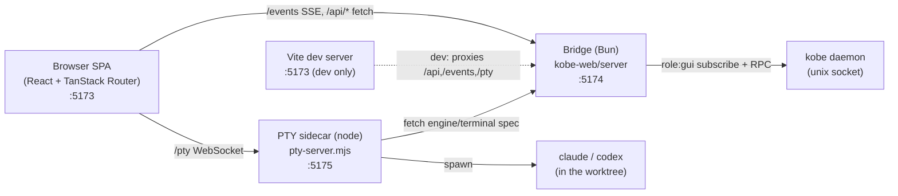

# Web dashboard (`kobe web`) — architecture

> The browser dashboard for kobe: a terminal-native workspace at
> `http://localhost:5173`, not a faithful TUI mirror. Source lives in
> [`packages/kobe-web`](../../packages/kobe-web). This doc is the durable map
> of its process model, the daemon channels it consumes, and the bridge's
> HTTP route table. For the running feature set read the CHANGELOG; for the
> daemon protocol read [`daemon.md`](./daemon.md).

## Why three processes

`node-pty` does not work under Bun, and the bridge must not be able to take the
daemon down — so the web UI is split into three cooperating processes, never
hosted inside the daemon:

- **SPA** — single React app. State arrives over ONE SSE stream and a module
  store ([`src/lib/store.ts`](../../packages/kobe-web/src/lib/store.ts)); every
  mutation is a `POST /api/rpc`. No optimistic updates — the daemon's
  `task.snapshot` push is the round-trip.
- **Bridge** ([`server/`](../../packages/kobe-web/server)) — a standalone Bun
  HTTP/SSE server. Holds exactly ONE daemon socket
  ([`daemon-link.ts`](../../packages/kobe-web/server/daemon-link.ts)),
  subscribing with `role: "gui"` so an open browser holds the daemon alive
  like an attached TUI. Restartable without touching the daemon.
- **PTY sidecar** ([`pty-server.mjs`](../../packages/kobe-web/pty-server.mjs)) —
  a node process (node-pty needs node). Each engine/terminal tab is a
  WebSocket-attached PTY keyed by a client tab id, kept alive across reconnects
  with a bounded scrollback ring.

In production, `kobe web` ([`packages/kobe/src/cli/web-cmd.ts`](../../packages/kobe/src/cli/web-cmd.ts))
runs the bridge in-process serving the built SPA from `dist/web-ui`, and spawns
the PTY sidecar on `port + 2`. In dev, [`dev.ts`](../../packages/kobe-web/dev.ts)
spawns all three and Vite proxies `/api`, `/events`, `/pty`.

## Daemon channels the SPA consumes

The bridge subscribes with a channel filter
([`spa-channels.ts`](../../packages/kobe-web/server/spa-channels.ts)); the
daemon honors it, so unconsumed channels never cross the socket. A contract
test (`test/spa-channels.test.ts`) partitions every protocol channel into
consumed vs dropped so a new channel can't slip through unaccounted.

| Channel | What the SPA does with it |
|---|---|
| `task.snapshot` | The authoritative task list. On each push the store sweeps per-task side tables (engine badges, jobs, workspace tabs + their PTYs) for tasks that no longer exist — a delete in any surface cleans up here too. |
| `active-task` | Cross-surface focus (the TUI/another browser switching tasks). |
| `engine-state` | Per-task activity dot + label (running / needs input / rate limited / error / idle). |
| `update` | npm-version chip in the status bar. |
| `task.jobs` | "materializing…" spinner on a row while a worktree is created. |
| `worktree.changes` | `+N −M` dirty chips on rows; also the live-refresh trigger for the diff surfaces (no browser-side git polling). |
| `ui-prefs` | Theme + sort-mode sync with the TUI — a TUI theme switch restyles open dashboards live. |
| `keybindings` | **Dropped** — the web has no keymap to re-read. |

## Bridge HTTP route table

All routes live in `createRequestHandler`
([`server/bridge.ts`](../../packages/kobe-web/server/bridge.ts)), extracted from
`Bun.serve` so the whole surface is unit-testable against a fake link
(`test/bridge-routes.test.ts`).

| Route | Method | Purpose |
|---|---|---|
| `/__kobe_web` | GET | Health marker for the port-takeover handshake. |
| `/events` | GET | SSE: `snapshot` on connect, then `channel` pushes. |
| `/api/rpc` | POST | Forward an **allowlisted** daemon RPC. See below. |
| `/api/session` | POST | Ensure a task's tmux session exists (engine PTY backing). |
| `/api/engine-spec` / `/api/terminal-spec` | GET | PTY launch spec for an engine / shell tab. |
| `/api/engines` | GET | Engine-owned vendor list (detected built-ins + custom, with display labels) — the SPA never hard-codes vendor strings. |
| `/api/themes` | GET | The TUI's 7 theme JSONs resolved into the web CSS token vocabulary. |
| `/api/history/sessions` / `/api/history/messages` | GET | Structured engine transcript via the registry's neutral `EngineHistoryReader` (path-traversal-guarded). |
| `/api/notes` | GET/PUT | Web-only per-task markdown scratchpad. |
| `/api/diff` | GET | Worktree diff (names-only or per-file patch; bounded-concurrency for untracked files). |
| `*` | — | Static SPA fallthrough (production), else 404. |

### `/api/rpc` is an allowlist, not a denylist

The forwarder admits only the verbs in
[`rpc-allowlist.ts`](../../packages/kobe-web/server/rpc-allowlist.ts) — a new
daemon verb is NOT browser-reachable until added deliberately, and
connection-scoped (`hello`/`subscribe`), kill-switch (`daemon.stop`), and
hook-ingest (`engine.reportEvent`/`worktree.reconcile`) verbs are pinned out by
a contract test (`test/rpc-allowlist.test.ts`).

### Teardown hook — the daemon never touches tmux

The daemon is the single writer for the task index but never touches tmux. So a
committed `task.delete` / `task.archive` (when actually archiving) triggers a
bridge-side `tearDownTaskSession` — killing the task's tmux session and the
engine inside it. Without this a web delete leaves an orphaned engine running,
the same bug `kobe api delete` had. Un-archive (`archived: false`) deliberately
does NOT tear down.

## SPA routes

TanStack Router, file-based ([`src/routes/`](../../packages/kobe-web/src/routes)):

| Route | Surface |
|---|---|
| `/` | The workspace shell (rail + tabs + tools). |
| `/task/$taskId` | Deep link — selects the task; back/forward walks task-switch history. |
| `/overview` | Mission-control triage of every task (needs you / working / dirty / quiet). |

## Workspace tabs

Tab + split state is purely client-owned and persisted in localStorage
([`src/lib/tabs.ts`](../../packages/kobe-web/src/lib/tabs.ts)). Tab kinds:

- **vendor** — engine PTY (with a prompt composer + reattach affordance). xterm
  is lazy-loaded so it only weighs on first terminal open.
- **terminal** — shell PTY in the worktree.
- **transcript** — structured read-only chat render over `/api/history`.
- **file** — read-only diff preview (with a line-number gutter + `+/−` stats).

## SPA surfaces & client modules

Beyond the rail/tabs/tools grammar, the dashboard carries:

- **Command palette** (Cmd/Ctrl+K) — fuzzy task jump + actions; `?` opens a
  keyboard-help overlay. ([`CommandPalette.tsx`](../../packages/kobe-web/src/components/CommandPalette.tsx), [`KeyboardHelp.tsx`](../../packages/kobe-web/src/components/KeyboardHelp.tsx))
- **New Task / Adopt** dialogs (`task.create` / `worktree.discoverAdoptable`+`adopt`); New Task can seed a first prompt into the engine composer.
- **Settings** — live theme picker (precedence: web-local override > TUI `ui-prefs` > claude, [`lib/theme.ts`](../../packages/kobe-web/src/lib/theme.ts)), engines, notifications, connection/version.
- **Desktop notifications** ([`lib/notify.ts`](../../packages/kobe-web/src/lib/notify.ts)) — fire on the rising edge into `waiting_permission`/`error` while the tab is hidden.
- **Resilience** — a root error boundary (no white-screen) and a daemon-offline banner; failed mutations surface in a toast stack ([`lib/toast.ts`](../../packages/kobe-web/src/lib/toast.ts)).

Pure helpers with unit tests: [`lib/diff-rows.ts`](../../packages/kobe-web/src/lib/diff-rows.ts) (gutter + stats), `lib/time.ts` (relative time), the extracted `shouldNotify` / `resolveEffectiveTheme`, the markdown renderer's escape-first safety, and the reducer layer on both sides — the store's `applyJobEvent` / `isOrphanIdleEngineState` / `pruneByTask`, the bridge `DaemonLink` mirror (engineStates prune + jobs reducer + SSE forward filter, driven through a test seam), the shared `activityColor` / `activityLabel` mapping, `formatError`, and the New Task pending-prompt consume-once handoff — plus the bridge route + channel + allowlist contracts.

## Dev: production vs sandbox

`bun --filter kobe-web dev` connects to the **production** `~/.kobe` daemon and
prints a banner saying so. `bun --filter kobe-web dev:sandbox` points
`KOBE_HOME_DIR` at the TUI's shared `.dev-sandbox/home` (+ the `kobe-sandbox`
tmux socket) so the bridge, PTY engines, and tmux stay isolated. `bun run test`
touches no daemon at all — its isolation is unconditional.

## Security posture (current + gaps)

Both the bridge ([`bridge.ts`](../../packages/kobe-web/server/bridge.ts)) and the
PTY sidecar ([`pty-server.mjs`](../../packages/kobe-web/pty-server.mjs)) bind
**`127.0.0.1` by default** (was `0.0.0.0` — Bun/Node's default exposes every
interface); `KOBE_WEB_HOST` overrides only when a LAN bind is intended. A PTY WS
is arbitrary command exec in the worktree, so the upgrade enforces a
**localhost-Origin allowlist** (`localhost`/`127.0.0.1`/`[::1]`) — a browser
cross-origin upgrade is rejected; a non-browser client (no `Origin`) is allowed
since there's no ambient browser session to ride.

Remaining gap: there is still **no bridge auth token**, and the HTTP routes
(`/api/rpc`, `/events`, `/api/notes`) have no Origin check (only the `/pty` WS
does). The `/api/rpc` allowlist + the teardown contract bound the RPC blast
radius, but a bridge-issued token + an Origin allowlist on the HTTP routes is
the next step before the dashboard graduates from localhost-only. Deliberately
deferred — loopback bind + the PTY Origin check already close the default
exposure, and a token would add friction to the dev flow with no localhost payoff.
