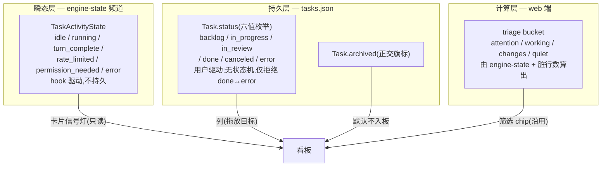
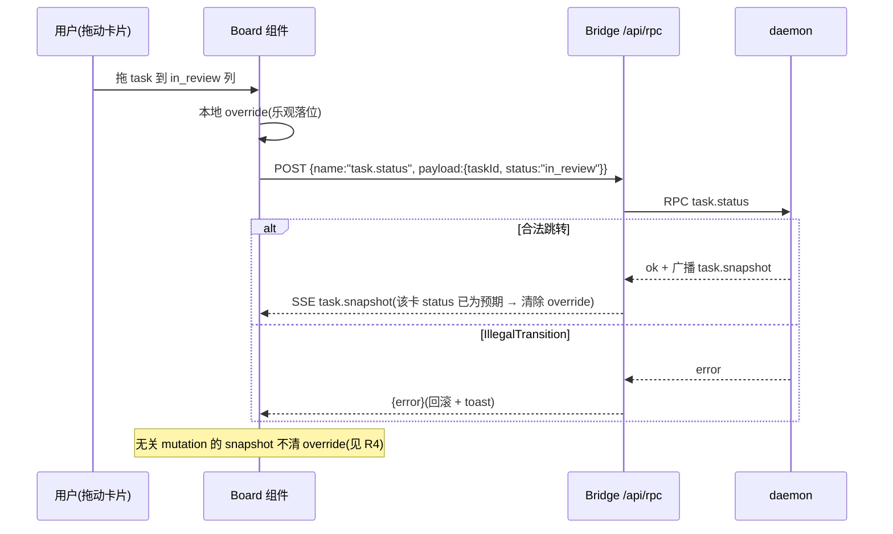

# kobe web 看板(Kanban)— 研究计划

> 目标:在 `kobe web` 仪表盘中加入一个 [multica](https://github.com/multica-ai/multica)
> 风格的看板视图,把任务按状态分列、支持拖拽流转。本文是**研究计划**,不是实施设计:
> 先给出已完成的调研结论(multica 本体 + kobe 现状),再给路线建议、剩余研究问题、
> 里程碑与风险。调研日期 2026-06-11,multica 侧数据以当日 `main` 分支为准。
> 配套架构文档见 [`web-dashboard.md`](./web-dashboard.md)、[`tasks.md`](./tasks.md)。

## TL;DR

1. **multica 无法"内嵌",只能"借鉴"。** 它不发布任何 npm 包(`@multica/*` 全部
   `private: true`,registry 404),前端是整套 Next.js App Router 应用,背后必须有
   Go + PostgreSQL 17 + Redis 服务端;其 LICENSE 是**修改版 Apache-2.0**(GitHub 标记
   NOASSERTION),明确禁止未经商业授权"将 Multica 作为组件嵌入销售的产品",且要求保留
   前端品牌。技术与许可证双重堵死了 iframe / 组件复用两条路。
2. **kobe 的地基比预想好。** `Task.status` 已经是看板形状的六值枚举
   (`backlog | in_progress | in_review | done | canceled | error`,
   [`task.ts:43`](../../packages/kobe/src/types/task.ts)),与 multica 的 Issue 状态列
   几乎同构;`task.status` RPC 已在 web 放行名单里
   ([`rpc-allowlist.ts:33`](../../packages/kobe-web/server/rpc-allowlist.ts)),
   实时管道(daemon → bridge SSE → SPA store)现成。**做到"拖卡片换列"为止,
   daemon 协议一行都不用改。**
3. **唯一的硬缺口是列内排序。** `Task` 没有 position 字段,现有 `task.move` 只能在
   侧栏分区内 ±1 挪动。列内自由排序需要新增持久化字段 + 一个 `task.reorder` 类 RPC,
   这是整个项目里唯一要动协议面的部分,放到最后一个里程碑。
4. **建议路线:自建看板视图(路线 C),借鉴 multica 的交互语义而非代码**;按
   M0 研究收口 → M1 只读看板 → M2 拖拽换列 → M3 列内排序 → M4 板内 peek 抽屉,
   五个里程碑推进。

### 已拍板(2026-06-11,用户决定)

1. **列的分类轴 = 工作流状态(`Task.status`)。** 不引入自定义分类/标签字段;repo
   维度用筛选器(任务量大后再考虑泳道)表达。R1 相应收窄为列收纳细节。
2. **点卡片 = 跳转 `/task/$taskId` 复用现有工作区(M1 起);板内 peek 抽屉
   (不离开看板内嵌 engine PTY + transcript)立为 M4**,研究项见 R9。
3. **定位:看板是"活会话"的透镜,不是工单系统。** kobe 的卡片天生背着常驻、可
   resume 的引擎会话(Task = worktree + engine session + branch)——与 multica
   "卡片是工单、代理是外挂执行者"的模型相反。点开卡片落到的就是那个活会话:
   engine PTY([`ChatTerminal`](../../packages/kobe-web/src/components/ChatTerminal.tsx))、
   transcript 回放(engine-owned `EngineHistory`)、`engine-state` 实时信号灯,
   全部现成,看板不新建任何会话管道。
   (实现期勘误:web 的 engine PTY **不是** attach tmux——PTY sidecar 按 tab id
   直接 spawn 引擎进程(`session.ts` `engineSpec`)。所以"同一会话"的关键是
   **复用 tab id**,见 R9 结论。)

## 1. multica 调研结论

### 1.1 它是什么

multica-ai/multica(36.3k stars,2026-01 创建,日更,当前 0.2.0)是开源的
"managed agents platform":一个 Linear 风格的 issue tracker,人类和 AI 编码代理
(Claude Code、Codex、Copilot CLI、Gemini、Cursor Agent…)同为 assignee。代理通过
本地 daemon 认领 issue、在隔离工作目录里自治执行、回帖评论、推动 issue 状态流转。
**看板只是它 issue tracker 的一个视图**(与列表视图并列),产品本体是带代理执行的
完整项目管理系统(workspace / project / squad / skill / autopilot / inbox)。

架构三层:Go 服务端(chi REST + gorilla WebSocket,Postgres 17 + pgvector + Redis,
JWT)、Next.js 16 前端(shadcn/ui + Tailwind + **dnd-kit** + Zustand + TanStack
Query)、本地 daemon(每 3s 轮询认领任务、15s 心跳、为每个任务建隔离工作目录并
spawn 代理 CLI 子进程)。浏览器侧实时是 WebSocket 推送(`task:dispatch / progress /
message / completed / failed`)。

有意思的对照:multica 是**服务端中心**(daemon 轮询中央服务器),kobe 是**本地优先**
(daemon 就在本机,socket 直连)。kobe 等价物在结构上更简单,值得搬的是语义不是运行时。

### 1.2 它的看板数据模型

- **Issue 即卡片**,`status ∈ {backlog, todo, in_progress, in_review, done, blocked,
  cancelled}`,默认 backlog;另有 `priority`、多态 `assignee_type+assignee_id`
  (人或代理)、`parent_issue_id` 子任务、`position`(手动排序)。
- **列 = issue status**,不是代理运行队列状态。把 issue 指派给代理只是入队一条
  `agent_task_queue`(queued → dispatched → running → completed/failed);**推动卡片
  跨列的是代理本身**(改 issue status、发评论),队列状态不直接当列用。
- kobe 的对应:`Task.status`(持久,用户驱动)对应 issue status;
  `engine-state`(瞬态,hook 驱动)对应 agent/task-queue 状态。multica 的分层选择
  印证了 kobe 现有的两层模型方向是对的——**列绑定持久状态,瞬态活动只做卡片上的
  信号灯,不做列**。

### 1.3 为什么不能内嵌(证据)

1. npm 上不存在任何 `@multica/*` 包(`registry.npmjs.org/@multica%2Fcore` 404);
   workspace 包全部 `private: true`,且 exports 直接指向 `.tsx` 源文件,只能在它自己的
   pnpm catalog workspace 里消费。
2. 前端是完整 Next.js 应用,不是可挂载组件;README / docs / 官网均无 iframe/embed 能力。
3. 即便 iframe 自托管,也要拖上 Go + Postgres + pgvector + Redis 整套基础设施,且其
   Issue 数据模型与 kobe `tasks.json` 互不相通,等于并排跑两个产品。
4. LICENSE(修改版 Apache-2.0)红线:未经商业授权不得"将 Multica 作为组件嵌入销售的
   产品或服务"、不得据其提供第三方托管服务;前端 logo/版权标识不得移除。允许的是组织
   内部自用 self-host 和阅读研究。kobe 虽是免费开源,但靠近这条线没有任何收益——
   **结论:不搬任何 multica 代码,只搬交互与模型语义**(dnd-kit 本身是 MIT,可独立选用)。

### 1.4 值得借鉴的交互(自建时的对标清单)

- 一列一状态;**拖放即改状态**,落下立即生效,并把排序切到手动 position 模式。
- 卡片信息密度:标题 + assignee 头像 + 优先级徽标 + 截止日 + 子任务完成环。
  kobe 对应可上卡的现成数据:activity 信号灯([`activity.ts`](../../packages/kobe-web/src/lib/activity.ts)
  的 dot 色)、PR 状态(`Task.prStatus` 的 lifecycle/checkState)、脏行计数
  (`worktree.changes`)、vendor 徽标。
- 代理与人同构(多态 actor):kobe 单用户,无需 assignee,但"卡片上能看出引擎正在
  干活/等你"是同一诉求,由 engine-state 信号灯承担。
- 看板/列表双视图共享同一数据与筛选——kobe 对应:看板与现有 rail/Overview 共用
  `useAppState()`,不另建订阅。

## 2. kobe 现状

### 2.1 三层状态,谁来当列

关键裁决(与 multica 的选择一致):**列只绑定 `Task.status`**。瞬态活动态做成列会
"自己跳来跳去"且不可拖,只配做卡片上的信号灯;triage bucket 继续当筛选器。

### 2.2 已有地基(M2 之前零协议改动)

| 能力 | 已有实现 |
|---|---|
| 看板形状的状态枚举 | `TaskStatus` 六值,[`task.ts:43`](../../packages/kobe/src/types/task.ts) |
| 改状态的 RPC | `task.status`,已在 [`WEB_RPC_ALLOWLIST`](../../packages/kobe-web/server/rpc-allowlist.ts) |
| 实时推送 | `task.snapshot` / `engine-state` / `worktree.changes` 等 7 频道经 SSE 入 [`store.ts`](../../packages/kobe-web/src/lib/store.ts) |
| 路由挂载点 | TanStack Router 文件式路由,加 `src/routes/board.tsx` 即得 `/board`(自动 code-split) |
| 卡片素材 | activity dot([`activity.ts`](../../packages/kobe-web/src/lib/activity.ts))、`prStatus`、脏行计数、vendor |
| 非法跳转防护 | `done ↔ error` 互翻被拒(`IllegalTransitionError`,[`orchestrator/core.ts`](../../packages/kobe/src/orchestrator/core.ts) `setStatus`;注意**没有**完整状态转移矩阵,这是当前唯一被拒的跳转)——拖拽需处理 RPC 拒绝 |

### 2.3 缺口

| 缺口 | 影响 | 处置 |
|---|---|---|
| 列内排序无持久字段 | 同列卡片顺序不可拖 | **唯一必须的协议扩展**,M3 做(见 R2) |
| 无 DnD 依赖 | 需选型引入 | R3;WorkspaceTabs 现用 HTML5 native draggable 可参照 |
| store 无乐观更新 | 拖放后卡片要等 daemon 回推才落位,会"跳一下" | R4,可能仅看板局部做乐观层 |
| 路由级 UI 状态易丢 | [issue #7](../issues.json):rail 筛选态在 `/` → `/task/$taskId` 导航时重置 | R5,看板筛选态进 module store 或 URL |
| `kind: "main"` 任务定位 | 项目根任务不是工作流卡片 | R1 裁决(倾向不入板或单独泳道) |
| 错误名不过桥 | daemon 会序列化 `name: "IllegalTransitionError"`,但 socket client 抛 `new Error(message)` 丢掉 name,bridge 对一切失败统一回 `{ error: message }` + 500([`bridge.ts`](../../packages/kobe-web/server/bridge.ts))——前端只能脆弱地 string-match | R4 裁决:转发 error name(bridge/client 小改)还是容忍 string-match |

### 2.4 先例与文档立场

- DESIGN.md §6.2 曾有"kanban mode on top of Conductor"的 **v0.5 后端提案,已于
  2026-05-09 明确放弃**——那是引擎后端方案,与本计划(web 前端视图)无关,引用以免混淆。
- DESIGN.md §2.3 "give up … drag-drop" 约束的是 **TUI** 的终端优先哲学;web 仪表盘
  本来就是图形面("not a faithful TUI mirror",web-dashboard.md)。看板定位为
  **web-only 增强**,不要求 TUI 对等。落地时需在 web-dashboard.md 补一节,并把这个
  定位写明,避免与 §2.3 表述打架。
- 除此之外 docs/、issues.json 中无任何看板/board 规划——这是全新面,无历史包袱。
  (注:`grep -i kanban docs/` 还会命中 **vibe-kanban**,那是 DESIGN.md §7.3 用作
  executor 接口参考的归档竞品,与 UI 看板无关,勿混淆。)

## 3. 路线对比

| 路线 | 做法 | 评估 |
|---|---|---|
| A. iframe 自托管 multica | 旁挂整套 multica,kobe web 内嵌其页面 | ❌ 拖上 Go+Postgres+Redis;数据模型与 tasks.json 互不相通;许可证嵌入条款风险;UI/主题/认证全异质 |
| B. 移植 multica 前端代码 | 把它的 board 组件搬进 kobe-web | ❌ 无发布包可消费,只能手抄源码——许可证红线直接命中;且其组件耦合 Next.js + 它的 store/API 层 |
| **C. 自建视图,借鉴语义** | 在 kobe-web 加 `/board` 路由,绑定现有 `Task.status` + SSE,DnD 库另选(MIT) | ✅ **推荐**。M2 前零协议改动;主题/键盘/状态管理与现有 SPA 同构;法律干净 |

## 4. 剩余研究问题 R1–R9(R1–R8 在 M0 收口;R9 在 M4 前收口)

### M0 收口结论(2026-06-11)

- **R1**:常驻列 = `backlog / in_progress / in_review / done` 四列;`error` 与
  `canceled` 列**仅在非空时出现**(空时整列隐藏,避免常驻噪音)。未知 status
  (更新的 daemon 加了新值)不丢卡——按原始字符串动态成列,排在已知列之后。
  入板过滤:排除 `archived` 与 `kind: "main"`(与 Overview 同口径)。done 列
  M1 按 updatedAt 倒序;增长收纳政策(截断 + "+N more")到 M3 落地。
- **R2**:M3 时定稿,倾向 `position?: number` 浮点 fractional + daemon 间隙过小时
  整列重归一化;`task.reorder { taskId, status, beforeId? }` 形状进 RFC。
- **R3**:选 **@dnd-kit**(core;M3 加 sortable)。理由:MIT;键盘 sensor 可在
  jsdom 用 RTL 驱动(直接满足 R8);PointerSensor 覆盖触屏;multica 同款经过
  大规模验证;React 19 兼容在 M2 安装时验证,不兼容则降级 pragmatic-drag-and-drop。
- **R4**:乐观层放**看板自己的 module store**(`lib/board-state.ts`),不动全局
  store 的"无乐观更新"语义。清除条件:RPC reject → 立即回滚 + toast;RPC resolve
  → 保留 override 直到某次 `task.snapshot` 中该卡 status === 预期值才移除(无关
  snapshot 不清);snapshot 显示任务已消失 → 丢弃 override。断线
  (`!daemonConnected || !streamConnected`)禁拖。错误识别:**做** error-name
  转发——daemon client 把 `frame.error.name` 附到抛出的 Error 上,bridge 在
  `{ error }` 外加 `name` 字段;daemon 协议不动。
- **R5**:`/board` 顶级路由;筛选 query 放 `lib/board-state.ts` module store
  (issue #7 的同构解法),跨导航存活、刷新清零。
- **R6**:卡片 = activity dot + 标题(fallback branch/id)+ PR chip + 脏行 ±计数
  + pinned 标记 + branch(mono)+ activity label + 相对时间。`PrChip`/`ChangesChip`
  从 AppShell 抽到共享组件文件复用,避免双份漂移。主点击跳 `/task/$taskId`
  (与 Overview.open 同路径);次级动作推迟到 M4。
- **R7**:position 仅 web 看板消费(M3 进协议时注释写明);TUI sidebar 不变。
  web 高频改 status 对 TUI 的扰动在 M2 验收时双端实测一次。`ui-prefs` 第一期
  不加看板偏好。
- **R8**:列分桶/排序/过滤纯函数进 `src/lib/board.ts`,vitest 单测
  `test/board.test.ts`;M2 给 override store 加单测 + RTL 键盘拖拽用例;M3 扩展
  `rpc-allowlist.test.ts` / `spa-channels.test.ts` / `store-reducer.test.ts`;
  behavior harness 不涉网页,跳过。

每条:**问题 → 关键考量 → 方法 → 产出**。

- **R1 列收纳细节。**(列轴已拍板为 `Task.status`,本条只剩收纳裁决。)
  六个 status 全做列,还是 `canceled`/`error` 折叠为收纳区?
  `archived` 卡片是否彻底不入板(倾向是)?`kind: "main"` 任务不入板还是单独泳道?
  另:`done ≠ archived`(正交旗标),不归档的用户 done 列会**无限增长**——需定收纳
  政策(类 Linear 的时间窗"最近 N 天" / 数量上限 / 卡片上一键归档)。
  方法:对照 multica(7 列全显示)+ 现有 rail 分区规则推演;在 M1 只读板上用真实
  任务集目检。产出:列清单 + 入板过滤规则 + done 收纳政策,写进本文档 §5。
- **R2 列内排序持久化设计。** `Task.position`(fractional indexing,如 LexoRank 式
  字符串键)vs 整数重排(每次拖动重写同列所有序号)vs 复用 tasks.json 数组序扩展
  `task.move` 语义。需兼容现有 pinned/main 分区排序与 `sortMode: recent`,并考虑
  tasks.json 旧数据无字段时的回退(按 createdAt)。方法:读现有排序/move 实现——
  [`orchestrator/index/store.ts`](../../packages/kobe/src/orchestrator/index/store.ts)
  的 `move()`(分区内 splice)与
  [`orchestrator/core.ts`](../../packages/kobe/src/orchestrator/core.ts) 的 `moveTask`
  (分区 = 非 main + 同 archived + 同 pinned)——出 1 页 RFC 比较三方案。
  产出:字段 + `task.reorder` RPC 形状(进协议 + allowlist + 契约测试)。
- **R3 DnD 库选型。** 候选:`@dnd-kit`(multica 同款,MIT,a11y/键盘拖拽好,React 19
  兼容需验证)、`@atlaskit/pragmatic-drag-and-drop`(无渲染层、体积小)、HTML5 native
  (零依赖,WorkspaceTabs 已用,但跨列放置指示、键盘都要手写,且 **HTML5 DnD 在触屏上
  完全不工作**——这条基本判死零依赖路线,除非触屏走无拖拽 fallback)。硬性选型标准:
  ① bundle 体积(按路由 code-split,只进 /board chunk);② 键盘可达性(kobe 键盘文化);
  ③ **jsdom 可测性**(HTML5 DnD 在 jsdom 里测不了;dnd-kit 的键盘 sensor 可以用 RTL 驱动
  ——直接决定 R8 的测试面);④ 触屏支持或明确 fallback(触屏用户在卡片上出状态菜单,
  不拖);⑤ 维护活跃度。方法:各做 30 分钟 spike(两列 + 拖放 + 键盘)。
  产出:选型决定 + spike 分支。
- **R4 拖放的乐观更新与失败路径。** 现状全 SPA 无乐观更新(daemon `task.snapshot`
  回推即 round-trip),拖放若等回推,卡片会先弹回再落位。方案:看板组件持本地
  override 层(taskId → 预期 status)。**清除条件必须精确**:不能"任意 snapshot 即清除"
  ——`task.snapshot` 是任何 mutation 都触发的全量替换,无关变更(TUI 改名、别的任务归档)
  会提前清掉 override 造成弹跳;正确条件是"RPC 已 settle,或 snapshot 中该 task 的
  status 已等于预期值"。还需覆盖:拖动中途卡片被其他端删除/归档/改状态(放手时按
  最新 snapshot 校验,失效则取消并 toast);双浏览器同拖同卡(接受 last-writer-wins,
  写明即可);**断线防护**——store 已暴露 `daemonConnected` / `streamConnected`,
  任一为 false 时禁用拖放,否则 daemon 重启窗口里的拖动会乐观落位后静默丢失。
  失败识别:见 §2.3"错误名不过桥"——在此一并裁决转发 `DaemonError.name`(bridge/client
  小改,daemon 协议不动)还是 string-match;同时留意 `ConcurrencyCapError` 等未来可能
  出现的第二种拒绝类型,回滚设计不要写死单一错误。方法:在 store.ts 之外做组件级实验,
  不动全局 store 语义。产出:乐观层归属(组件局部 vs store)+ 清除条件 + 错误转发裁决。
- **R5 路由与筛选态持有。** `/board` 为顶级路由(与 `/`、`/overview` 并列),入口加进
  命令面板与顶栏。看板的筛选/搜索态吸取 issue #7 教训,放 module store 或 URL search
  params。方法:复盘 issue #7 的修复方向,与之同构。产出:状态持有方案。
- **R6 卡片信息密度。** 第一版卡片上放什么:标题、activity dot、vendor 徽标、PR chip
  (lifecycle + checkState)、脏行 ±计数、相对时间?主点击已拍板(跳 `/task/$taskId`),
  本条剩余:卡片上的次级动作(一键归档?复制分支名?)与 hover 信息。方法:对照
  multica 卡片 + 现有 rail 行已渲染的数据,纸面稿即可。产出:卡片字段清单 + 交互表。
- **R7 与 TUI 的双向关系。** 正向:TUI sidebar 是否消费 position(倾向第一期不消费,
  position 仅 web 看板用,但字段进协议时要写清这一点)?`ui-prefs` 要不要加看板偏好
  (如默认视图)?**反向(易漏)**:TUI sidebar 按 status 分组、每次 `task.snapshot`
  重排——web 看板高频驱动 status 变化时,TUI 任务列表会在用户光标下实时跳动,需实测
  光标稳定性与分组跳变是否可接受;同时确认 `kobe api task status` CLI 与看板走同一
  RPC、行为一致。方法:与 R2 一起在 RFC 里裁决 + 双端实测一次。
  产出:协议注释 + 一段文档说明 + TUI 侧体验结论。
- **R8 测试策略。** 沿用仓库既有模式(web-dashboard.md:"组件逻辑住在 React-free 的
  lib 模块里,脱离 .tsx 做单测"):列分桶/入板过滤/override 层全部写成纯函数
  `lib/board.ts`,vitest 单测;M3 扩展现成契约测试
  ([`test/rpc-allowlist.test.ts`](../../packages/kobe-web/test/rpc-allowlist.test.ts)、
  `test/spa-channels.test.ts`、`test/store-reducer.test.ts`);交互层用 RTL 驱动键盘
  拖拽(R3 已把 jsdom 可测性列为选型标准);tmux behavior harness 明确不在 web 范围。
  方法:M0 只立约定,无需产出代码。产出:本条写进各里程碑验收。
- **R9 板内 peek 抽屉(M4 前收口,不阻塞 M0)。** 不离开看板,侧拉面板内嵌该任务的
  engine PTY + transcript。会话管道全复用:PTY sidecar 的 WebSocket attach
  (`/pty?tab=&taskId=&mode=engine`)、scrollback ring、`/api/history`。要研究的是
  生命周期与并存:抽屉关闭时 PTY tab 保留还是 close;抽屉与工作区对同一引擎会话
  **双 attach** 是否安全;布局(抽屉宽度、焦点陷阱、Esc 关闭)。
  **M4 结论(2026-06-11)**:① web 的 PTY 按 **tab id** 键进程,不是 tmux attach
  ——抽屉必须复用任务工作区的 vendor tab id(`tabs.ts` `ensureEngineTab`,无则代建),
  否则会给同一任务 spawn 第二个引擎实例;② 双 attach 天然安全:sidecar 的
  `entry.sockets` 是 Set,输出向所有连接扇出,尺寸 last-resize-wins(且 /board 与
  workspace 是互斥路由,同浏览器不会并发 attach);③ 关抽屉只断 WebSocket,
  **不调 `/pty/close`**——PTY 服务端存活,重开抽屉 scrollback 回放,会话无损;
  ④ Esc 关抽屉,但焦点在 xterm 或输入框内时放行(引擎里的 vim/菜单需要 Esc)。

## 5. 里程碑

| 里程碑 | 范围 | 验收 | 协议改动 |
|---|---|---|---|
| **M0 研究收口** | R1–R8 全部出产出;R3 含 spike | 本文档 §4 每条有结论;DnD 选型定 | 无 |
| **M1 只读看板** | `/board` 路由;按 status 分列;卡片含 R6 字段;实时跟随 SSE;入口(顶栏 + 命令面板);分桶/过滤逻辑落 `lib/board.ts` + 单测(R8) | 多任务实况下列与卡片实时正确;移动端可横滚 | 无 |
| **M2 拖拽换列** | DnD 接入;拖放调 `task.status`;乐观层(R4 清除条件)+ 失败回滚;键盘拖拽;断线禁拖;触屏 fallback(R3) | 拖放即改状态不闪跳;非法跳转回滚有 toast;全键盘可完成一次流转;断线时拖放被禁用 | daemon 协议无;bridge 错误转发或有小改(R4 裁决) |
| **M3 列内排序 + 打磨** | position 字段 + `task.reorder` RPC(协议 + allowlist + spa 契约测试三表同步);列内拖序;收尾(空列占位、列计数、筛选态持久、done 收纳政策落地) | 列内顺序跨刷新/跨端稳定;契约测试过 | **有**(唯一一次) |
| **M4 板内 peek 抽屉** | 看板侧拉抽屉内嵌 engine PTY + transcript(R9);卡片次级动作(R6) | 不离开看板可查看/接管会话;关抽屉不杀会话;与工作区双 attach 无冲突 | 无(复用 `/pty` 与 `/api/history`) |
| **M5 自动流转(opt-in)** | 开工:daemon 规则 turn-start → `backlog → in_progress`;收工:spawn 时注入 system prompt,agent 自报 `in_review` | 单向、绝不 done/canceled、人手最终裁决;默认关 | 无(daemon 规则 + 启动参数注入) |

### M5 自动流转(2026-06-11 二次拍板:规则开工 + agent 自报收工;小模型 judge 已移除)

第一版用 `claude -p` haiku 终判收工,当天即移除——按"无歧义用规则,有歧义找
最知情者"重新分工:

- **开工 = daemon 规则**([`monitor/status-rules.ts`](../../packages/kobe/src/monitor/status-rules.ts),
  挂 `engine.reportEvent` 的 `turn-start`):引擎对 `backlog` 任务开跑一轮 =
  开工,无歧义,纯字段规则推到 `in_progress`。守门:仅此一个转移;用户摆在
  其他列的任务永不触碰。
- **收工 = agent 自报**([`engine/interactive-command.ts`](../../packages/kobe/src/engine/interactive-command.ts)
  `withStatusProtocol`):spawn 引擎时给 claude 追加
  `--append-system-prompt`,把**该任务的 id**和自报命令烘进会话的 system
  prompt——agent 是唯一知道"这轮是干完了还是在提问"的一方(Stop hook 对两者
  一视同仁,这一比特只存在于语义里)。协议只授权
  `kobe api edit set-status --task-id <id> --status in_review`,明令禁止其他
  状态。选 flag 不选文件:落 CLAUDE.local.md 会永久弄脏 worktree(污染 ±计数);
  flag 只作用于 kobe 拉起的会话,手动 `claude` 不受影响;system prompt 不会被
  上下文压缩冲掉。两个 spawn 路径都已接线(tmux `ensureSession` 与 web PTY 的
  `engineSpec`);自定义启动命令已带该 flag 时不重复注入(withClaudeSessionId
  同款先例)。codex 暂无等价 flag——它的卡片手动挪,待其 adapter 长出注入点。
- **开关**:一个开关管两半,默认**关**:Settings → Dev → Experimental 的
  "Auto status flow"(即 state.json `experimental.autoStatus`),各决策点
  实时读取,无需重启 daemon。注意注入发生在 spawn 时——开关打开后,**新**
  会话才带协议;已在跑的会话要 respawn 才有。

实施期每个里程碑落一个 changeset(patch,按仓库规则不自报 minor);M1 起在
[`web-dashboard.md`](./web-dashboard.md) 增补看板一节。

## 6. 风险与未决问题

- **许可证纪律**:对 multica 只读不抄,实现期不打开其源码对照写代码;依赖只引 MIT 的
  DnD 库。本文档已留证据链(§1.3)。
- **三张表契约**:M3 新增 RPC/字段必须同步 `WEB_RPC_ALLOWLIST`、`SPA_CHANNELS`(如有
  新频道)与 store reducer,契约测试会拦——这是机制不是风险,但要进 M3 验收。
- **看板默认不会"自己动"**:`Task.status` 是用户驱动的。M5 增加了 **opt-in** 的
  daemon 侧自动流转(turn-complete → 两级判定 → `in_progress → in_review`,见
  §5 M5),走的正是本条预留的"daemon 侧规则"路径;默认关闭,且永远不自动
  done/canceled。
- **性能预算**:看板一屏渲染全部任务(rail 只渲染可视行),且 `engine-state` /
  `worktree.changes` 推送频繁、每次都触发 store 订阅者重渲。第一期假设 **≤100 个任务**,
  按列 `useMemo`(键在 tasks 数组身份上);超过再考虑列内虚拟化——写明阈值,不提前优化。
- **multica 演进速度**:它日更且 0.2.0,本文档的对标语义以 2026-06-11 为准,不追新。
- **web 定位**:web 仍是 "not the product center"(DESIGN.md §12)。看板是增强而非
  转向;若用户要把 web 升格为产品中心,需先回 DESIGN.md 层面重新立项。

## 7. 参考

- multica:[repo](https://github.com/multica-ai/multica) ·
  [product-overview.md](https://github.com/multica-ai/multica/blob/main/docs/product-overview.md) ·
  [CLI_AND_DAEMON.md](https://github.com/multica-ai/multica/blob/main/CLI_AND_DAEMON.md) ·
  [LICENSE](https://github.com/multica-ai/multica/blob/main/LICENSE)(修改版 Apache-2.0,嵌入/托管需商业授权)
- kobe:[`task.ts`](../../packages/kobe/src/types/task.ts)(TaskStatus)·
  [`protocol.ts`](../../packages/kobe-daemon/src/daemon/protocol.ts)(频道 + RPC)·
  [`rpc-allowlist.ts`](../../packages/kobe-web/server/rpc-allowlist.ts) ·
  [`store.ts`](../../packages/kobe-web/src/lib/store.ts) ·
  [`web-dashboard.md`](./web-dashboard.md) · [`tasks.md`](./tasks.md)
- DnD 候选:[dnd-kit](https://github.com/clauderic/dnd-kit) ·
  [pragmatic-drag-and-drop](https://github.com/atlassian/pragmatic-drag-and-drop)
